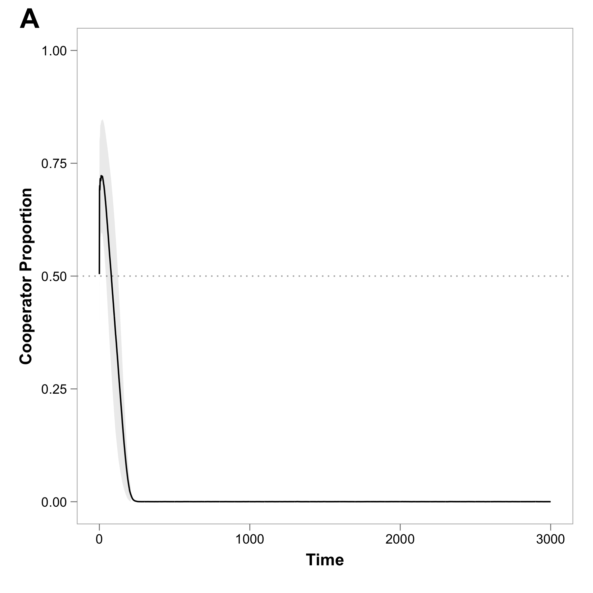
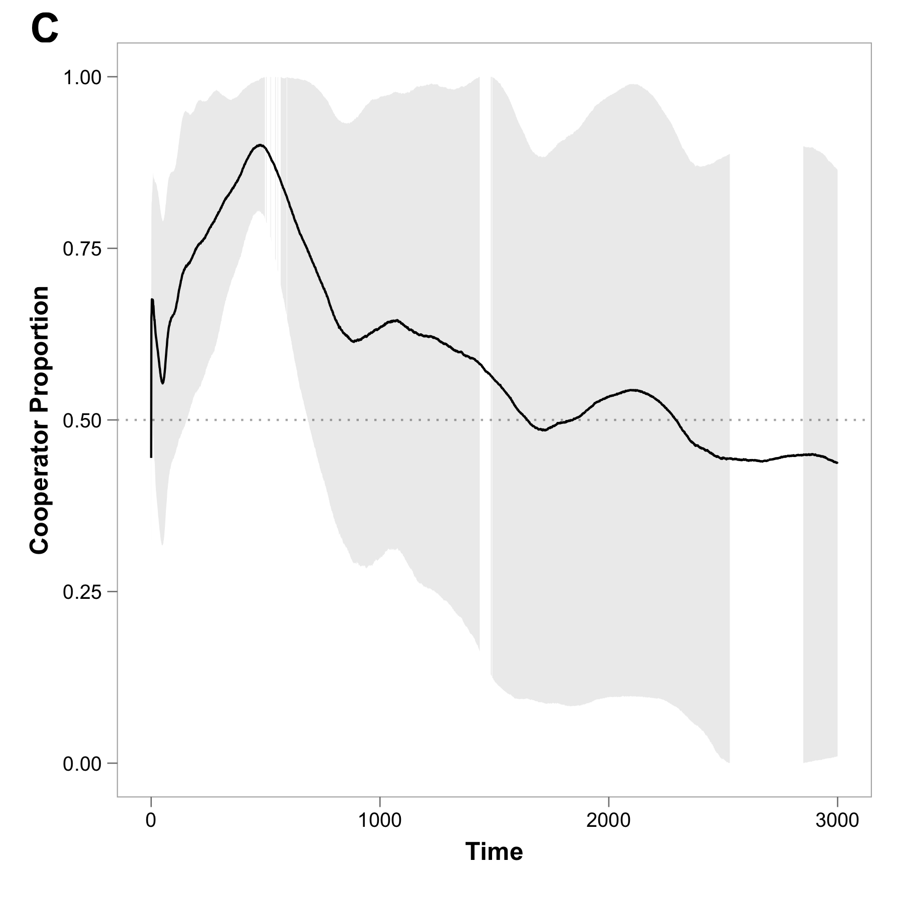
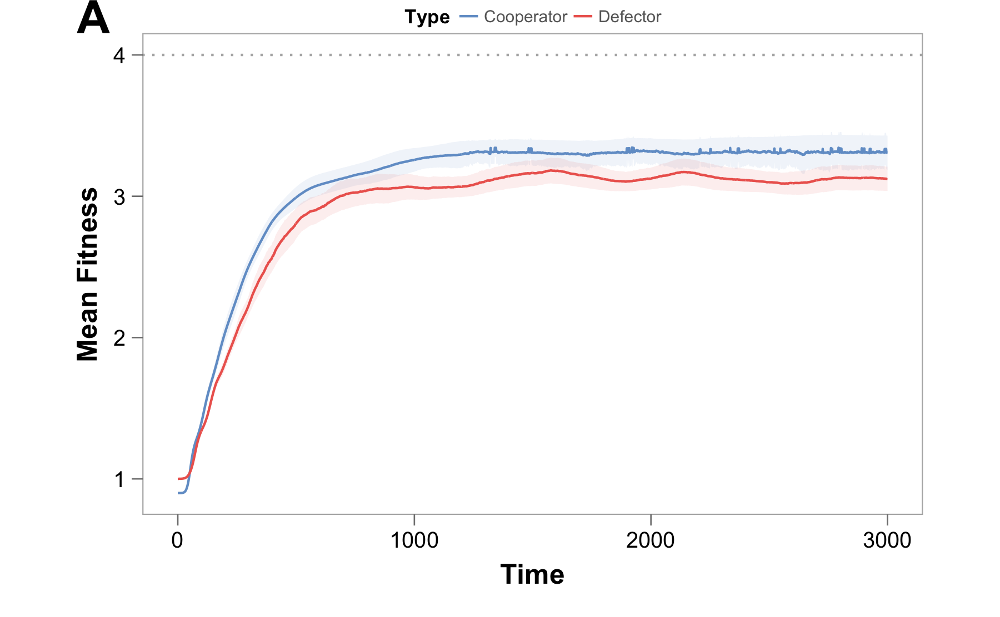
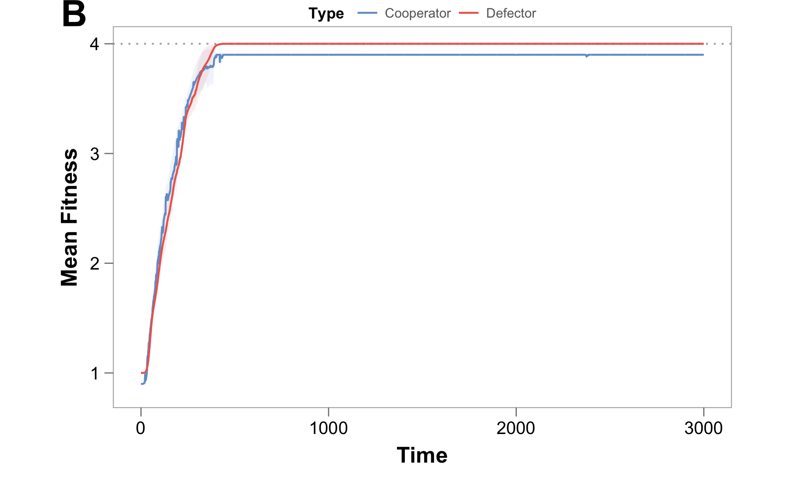
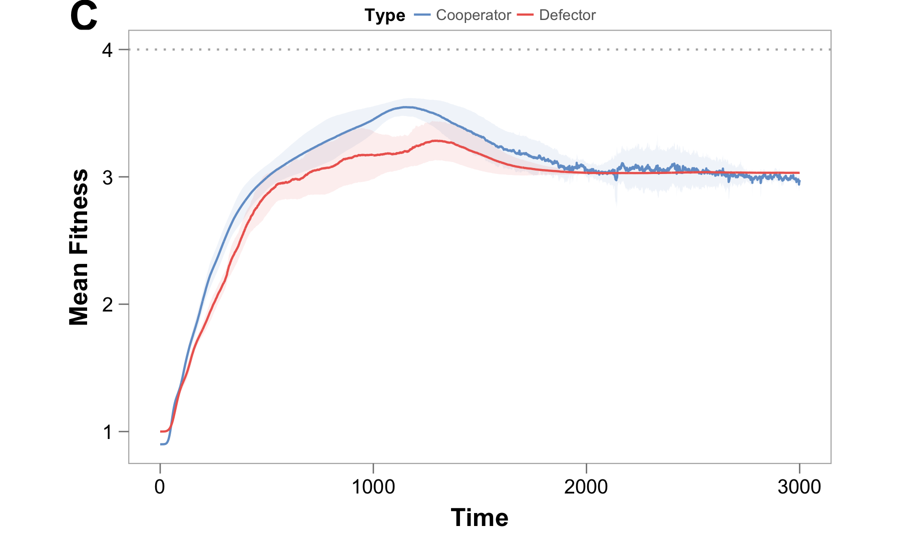
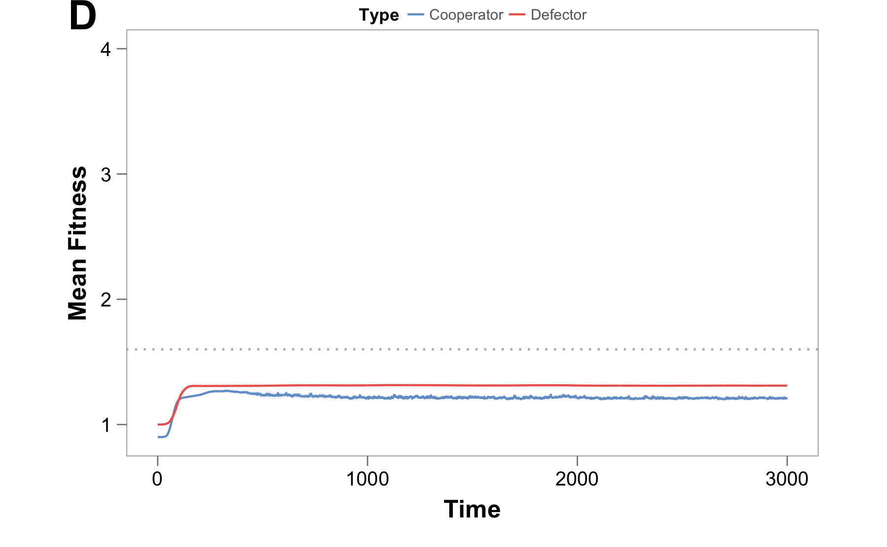

\newpage

# Figures

## Figure 1

### Figure 1A

\newpage

### Figure 1B

Proportion of cooperators over time with non-social adaptation

### Figure 1C

Proportion of cooperators over time with non-social adaptation and niche construction

## Figure 2

Plot showing integral for baseline values, double adaptive benefit (no NC, epsilon=0), no negative NC (L=5, A=5), Extreme negative niche construction (L=1, A=6)

## Figure 3

Mean fitness over time for the treatments shown in Figure 2

### Figure 3A - Fitness for base case: niche construction

### Figure 3B - Fitness with double delta, no epsilon

### Figure 3C - Fitness with no negative niche construction (L=5, A=5)

### Figure 3D - Fitness with extreme negative niche construction (L=1, A=6)

## Figure 4

Cooperators invade from single population

## Figure 5

Defectors are kept at bay

## Figure 6

### Figure 6A - Effect of Migration Rate (m)

### Figure 6B - Effect of Public Good Benefit (Smax-Smin)
