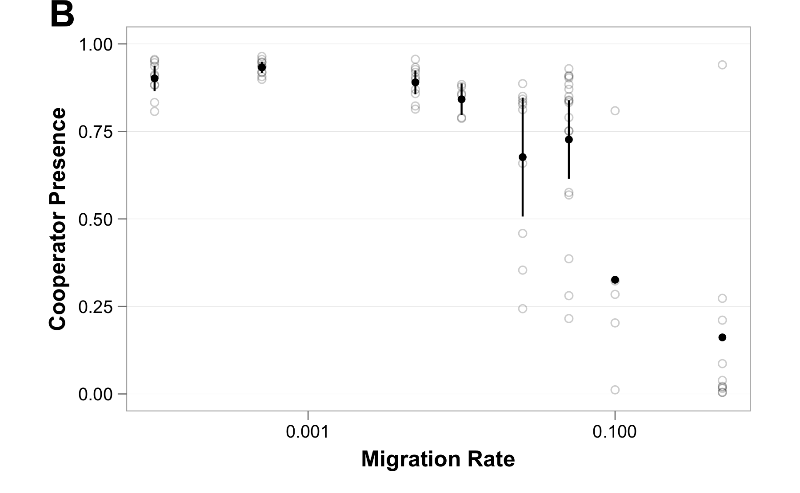

\clearpage

# Figures

## Figure 1

. (**A**) When there is no opportunity for adaptation ($L$, the number of adaptive loci, is zero), cooperation is quickly lost. (**B**) When adaptation can occur ($L=5$), but populations do not alter their environment ($\epsilon$, the intensity of niche construction, is zero), cooperators temporarily rise in abundance before eventually going extinct. (**C**) Niche construction enables cooperation to be maintained indefinitely. After 3000 cycles, cooperation was the dominant phenotype in 13 of 18 replicate populations.](../figures/Figure1.png)

\clearpage

## Figure 2

![**Niche Construction and the Evolution of Cooperation.** The proportion of cooperators present in the population is shown for the duration of simulations. Curves show the average among replicates, and shaded areas indicate 95% confidence intervals. (**A**) Niche construction enables cooperation to be maintained indefinitely. In the majority of populations, cooperation remained as the dominant strategy. (**B**) When niche construction is removed ($\epsilon=0$) and the fitness benefit of adaptation is increased as compensation ($\delta=0.6$), cooperation is quickly lost when adapted defectors arise. (**C**) Without negative niche construction, cooperation is not maintained ($A=5$). Here again, cooperation is driven to extinction by equally-adapted defectors.](../figures/Figure2.png)

\clearpage

## Figure 3

![**Niche Construction and Invasion.** Curves trace the proportion of cooperators present in the population for the duration of 160 replicate simulations. In these experiments, we examined whether a strategy initiated at a single population in the center of the metapopulation lattice ($N=11$) can invade. Unless otherwise noted, we disable mutations ($\mu_{a}=0, \mu_{c}=0$) to focus on how invasion depends on particular combinations of genotypes. (**A**) When cooperators and defectors are matched (i.e., genotypes $(1,2,3,4,5)$), defectors quickly drive cooperators to extinction due to the cost of cooperation. (**B**) However, the adaptive opportunities produced by negative niche construction and density dependence can allow an adapted cooperator (genotype $(1,2,3,4,6)$) to invade a population of defectors. (**C**) These same adaptive opportunities can allow cooperators to resist invasion by matching defectors, which arise via mutation and remain a constant threat. Here, adaptation allows cooperation to persist in 91 populations ($\mu_{a}=0.00005$).](../figures/Figure3.png)

\clearpage

## Figure 4

Cooperators invade defector population. Fully adapted but mismatched. Negative NC.

## Figure 5

Defectors invade cooperator population. Fully adapted and matched. Role of Export.

## Figure 6

### Figure 6A - Effect of Public Good Benefit (Smax-Smin)

![**Cooperator Presence as a Function of Population Size and Migration Rate.** Cooperator presence for each replicate population is shown as an open circle. The mean among these replicates is represented by a filled circle, and bars indicate 95% confidence intervals. (**A**) Cooperator presence increases proportional to increases in population size. Here, the benefit of cooperation ($S_{max}$) is varied (the density-dependent fitness effects of niche construction are adjusted accordingly in the model parameter $\epsilon$).  (**B**) Cooperator presence decreases with migration rate ($m$). When migration is low, cooperators can not export their niche, which limits expansion. When migration is high, the defectors immigrate into populations more quickly than cooperators can adapt.](../figures/Figure6A.png)

### Figure 6B - Effect of Migration Rate (m)

