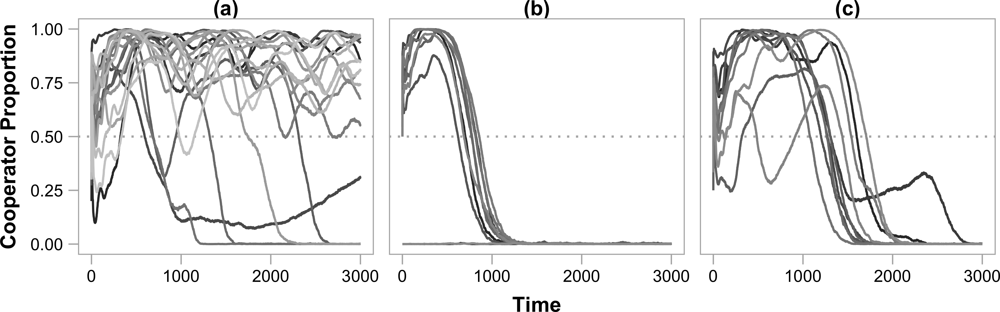

\clearpage

# Figures

## Figure 1

. (**A**) When there is no opportunity for adaptation ($L$, the number of adaptive loci, is zero), cooperation is quickly lost. (**B**) When adaptation can occur ($L=5$), but populations do not alter their environment ($\epsilon$, the intensity of niche construction, is zero), cooperators temporarily rise in abundance before eventually going extinct. (**C**) Selective feedbacks from niche construction allows cooperation to be maintained in 13 of 18 replicate populations. (**D**) While it does contribute to success, positive niche construction alone does not maintain cooperation ($A=5$).](../figures/Figure1.png)

\clearpage

## Figure 2

\clearpage

## Figure 3

Mean fitness over time for the treatments shown in Figure 2

### Figure 3A - Fitness for base case: niche construction

\clearpage

### Figure 3B - Fitness with double delta, no epsilon

\clearpage

### Figure 3C - Fitness with no negative niche construction (L=5, A=5)

\clearpage

### Figure 3D - Fitness with extreme negative niche construction (L=1, A=6)

\clearpage

## Figure 4

Cooperators invade from single population

## Figure 5

Defectors are kept at bay

## Figure 6

### Figure 6A - Effect of Public Good Benefit (Smax-Smin)

### Figure 6B - Effect of Migration Rate (m)

