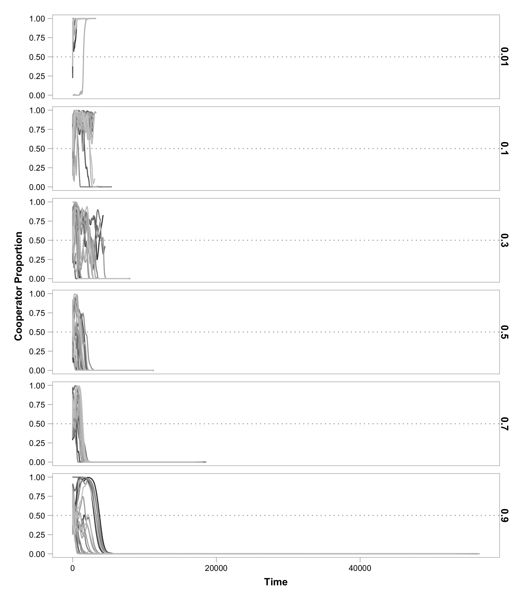

Dear Dr. Endler,

We are extremely grateful to you and the two anonymous reviewers for the thorough and thoughtful evaluation of our manuscript "Negative niche construction favors the evolution of cooperation".
The comments provided were very helpful and prompted changes that have greatly improved the manuscript.
In response to reviewer feedback, we have:

- Rewritten portions of the abstract, main text, figures, and table
- Performed simulations to elucidate the influence of additional key parameters
- Performed simulations to explore a wider set of initial conditions
- Included additional results as supplementary information

Below, we address each of the comments individually.
Each comment is shown **TODO formatting details**, and our response is shown immediately below **TODO formatting details**.

\rule{\textwidth}{1pt}

## Editor

> Here are my own comments about what I think are the most important points made by reviewer 1:

>He said "An important question for me is whether this mechanism really stabilises cooperation or merely slows its decline."  He also said "Does that fact that p is set to 0.5 at the start of the simulations make this paper really about the persistence of cooperation rather than its evolution? To show the latter, would the authors not consider testing their model with an initial p of 1/800 i.e. a single mutation? In how many such runs does cooperation then persist?"
There is a bit of a terminology mess here.  By "evolution" he means the origin and
spread of cooperation, which would be the case if the frequency increased from a very small value (as he said).  You started at 0.5 which might mean it is indeed more about maintainance than spread from a small value.  Regardless of what you call it, you actually cannot say that you are showing a mechanisms of stabilization unless you start at BOTH a small and a large value.  Stabilisation means that there is some kind of stable equilibrium. You cannot tell from only starting at 0.5, as you will see from any population genetics textbook.  Please fix this by starting at both a low and a high initial frequency.   This is the main reason I'm calling this a major revison.  Easy to do and report on but it will take more time than just rewriting.

TODO

> Here is another statement by this reviewer which I don't agree with: "Is this really negative niche-construction - "niche-constructing acts that, on average decrease the fitness of the niche-constructing organisms" - in the model, the niche-construction shifts the optimum value in the environment, but does not directly reduce fitness of the niche-constructors - instead it makes a higher relative fitness possible for others."  Evolution is about relative fitness, not absolute fitness (his comments are about absolute fitness), so, given that you have shown increased fitness of others but unchanged for the target, it's relative fitness (relative to the others)
HAS declined and you DO have negative niche construction.  Maybe just make this more explicit.

TODO

> Please give more thought and discussion about the external and the constructed environments, they are not necessarily coupled, in fact in some ways this is the entire point of niche construction.

TODO

> As reviewer 2 says, "More robust justification for imposing a ~90% death rate on each subpopulation every generation" is badly needed!  This is rather unrealistic, and makes the entire model rather dubious, unless you can show the same effects with a more realistic death rate (say 30%).

TODO

## Reviewer 1

> This paper extends an existing agent-based model of the evolution of cooperation through the effect of cooperation producing higher population densities, therefore higher absolute number of mutations and hence higher numbers of beneficial adaptations to what is termed the "external" environment, to incorporate the concept of niche construction and argue that what the authors term 'negative niche construction', but what I feel might be better represented as niche creation or extension, can actually stabilise costly cooperation in metapopulations.

> I found a lot to like in the paper and I definitely think it should be published. The model is a really neat (in the sense of elegant enough to facilitate real understanding, which is not something you can say about all agent-based models) take on the problem of coming up with tractable models to explore complex evolutionary interactions like niche construction. The main finding is clear, and the whole package is very nicely presented. I thought the analysis of the contrast between ecological (invasion) and evolutionary effects was particularly nice. There is nothing I strongly disagree with, but I do have a series of thoughts and questions about the paper which the authors could reflect on, along with some specific points where I felt presentation could be improved or clarified.

### General Questions

> An important question for me is whether this mechanism really stabilises cooperation or merely slows its decline. I look at Figure 1C and I see that while p is still non zero by T=3000, it is clearly declining. Would it eventually hit zero again or is an equilibrium achieved? Is the use of 'indefinitely' on L305 justified? Perhaps this is more of a presentation thing, because in Figure 2A it is clear that there are many populations with high levels of cooperation, albeit with a lot of oscillation - for me this begs the question of how big the metapopulation needs to be to buffer effectively against this degree of stochasticity…

Because our mechanism depends on adaptation to the environment via mutation, it is inherently stochastic.
We see this in Figure 2A, where cooperators were driven to extinction in four replicate populations.
In these cases, happened to adapt fastea than cooperators, and quickly spread to fixation.
As the reviewer notes, these results drive the decrease in average cooperator proportion across replicate populations that we see in Figure 1C (which motivated us to show data for individual replicates in all subsequent figures).

Because negative niche construction creates a never-ending "adaptive race", the possibility of cooperator loss through defector adaptation is also never ending.
However when cooperators maintain numerical dominance, a critical factor for the Hankshaw effect, they are more likely to be the first to adapt.
This is how cooperation was maintained in the majority of replicate populations shown in Figure 2A.

We feel that "indefinitely" is an appropriate description that captures both the cooperator persistence that we observe and the lingering potential for collapse, should defectors stochastically win the "adaptive race". [Note: removed from Figure 1 caption]

**TODO - sweep of metapopulation size**

**TODO - invasion?**

> Does that fact that p is set to 0.5 at the start of the simulations make this paper really about the persistence of cooperation rather than its evolution? To show the latter, would the authors not consider testing their model with an initial p of 1/800 i.e. a single mutation? In how many such runs does cooperation then persist?

This is a very important point that should have been addressed in the original manuscript.
To better understand this parameter, we have run additional simulations in which the initial proportion of cooperators were widely varied.
The results of these simulations are included as Supporting Information.

**TODO: specific location of results and figures**. **TODO: brief description of the results**.

Due to the thinning that occurs stochastically at the onset of each simulation (to maintain consistency with the Hammarlund et al. paper), it would be difficuly to perform simulations in which p0=1/800.
However, we have included simulations in which cooperators were entirely absent from the starting population but could arise via mutation.
**TODO: summary of results and where we've discussed/shown them**.

> Is this really negative niche-construction - "niche-constructing acts that, on average decrease the fitness of the niche-constructing organisms" - in the model, the niche-construction shifts the optimum value in the environment, but does not directly reduce fitness of the niche-constructors - instead it makes a higher relative fitness possible for others.

This interpretation of our model is correct.
Niche construction increases the absolute fitness of another type, thus decreasing the *relative* fitness of the niche constructing type.
Selection acts on relative fitness in our model.
If the social locus is fixed, subpopulations grow to the same size, regardless of absolute fitness.
However, by constructing an environment that favors another type, the niche constructing type puts itself at a selective disadvantage if a favored type arises by mutation.
Thus, even if the sole effect of niche construction is to raise the absolute fitness of another type relative to the focal constructor, this would qualify as a case of "negative niche construction" due to a lowered relative fitness.

The distinction between absolute and relative fitness and how they relate to niche construction has previously been discussed.
In his review of Odling-Smee, Laland, and Feldman's *Niche Construction: The Neglected Process in Evolution*, Okasha noted that the authors did not explicitly state whether positive and negative niche construction affected absolute or relative fitness (doi: [10.1007/s10539-005-0431-3](http://dx.doi.org/10.1007/s10539-005-0431-3)).
Laland, Odling-Smee, and Feldman responded: "In all cases in our models we are referring to relative fitness which is natural since we make standard population genetic assumptions..." (doi: [10.1007/s10539-004-6834-8](http://dx.doi.org/10.1007/s10539-004-6834-8)).
We have tried to make this clearer in our main text when "negative niche construction" is first introduced.

> There is a separation in the model between the "external" environment and the "constructed" environment, neither of which are modelled independently; rather they are implied from the way that the genetic makeup of organisms affects their fitness. This seems like a weak point of the model given that this separation is clearly an artificial construct - it would help the paper if the authors could give some thought to justifying this distinction - why doesn't niche construction affect the "external" environment. For example, is this a way that host/parasite interactions have been previously modelled? Further to this point, adaptation is usually associated with some degree of genetic load - i.e. the difference between optimal and actual genotypes in a given environment (e.g. L255). Can the authors say anything about whether an assumption of no genetic load is critical to their findings, or whether they think it is implicitly accounted for in their model in some way I have missed?

In natural settings, environmental change is often brought about by exogenous factors (e.g., changing seasons) as well as endogenous factors (e.g., niche constructing behaviors).
Many of its proponents argue that niche construction can substantially influence the evolutionary process, and this model is our first attempt at identifying how niche construction might play a role in cooperation.
The distinction that we make in the model between external and constructed environments allows us to directly address the effects of niche construction by comparison with a previous model in which only exogenous factors played a role.
We see this as a distinct advantage, as identifying and quantifying the selective feedbacks that niche construction introduces could be challenging.

As described in the discussion, we realize that implicitly modeling the niche's state can dampen the effects of some aspects of niche construction.
An explicit representation of the environment would certainly enrich a model such as ours and could permit investigation into host/parasite interactions or other systems where evolutionary dynamics occur on multiple scales.

TODO: Load.

> The setup of the circular chromosome and circular fitness implications is mathematically neat - however, it seems like a very specific set of assumptions about gene/environment interactions (for example, only when the modulus of L/A is non-zero) and one always worries about the generality of insights based on such a specific system. Can the authors provide any more information about where these assumptions might be met in nature, and/or what range of conditions or assumptions are needed for their insights to hold.

While we would not claim that our implementation represents any specific system in nature, it does allow adaptation to proceed in an unlimited manner, similar to an unending co-evolutionary arms race.
Alternate implementations, such as explicitly modeling adaptation using ever-increasing numbers of loci, would be computationally costly---likely prohibitively so.
This model is our compact attempt to capture the potentially never-ending co-evolution of organisms and their environment in a computationally tractable manner.

> Increased population density has only positive effects here - but density can also bring costs - this is ignored in the linear population growth of Eq 4; is it possible to say anything about how much cost can be borne before the effect disappears?

This is an important point.
We have expanded our model to explore different forms of population size increase as a function of cooperator proportion.
As detailed in the Supporting Information, we added an additional parameter to Equation 4, $\gamma$, to control whether the increases in population size accelerate ($\gamma > 1$) or decelerate ($\gamma < 1$) as cooperators become more abundant.

The following figure shows how these different forms of density-dependent benefits affect evolutionary trajectories in comparison to our baseline conditions ($\gamma = 1$).
Accelerating benefits tend to dampen oscillations and increase the proportion of cooperators in the replicate populations over time, while decelerating benefits tend to increase the magnitude of oscillations, allowing defectors to dominate.
Interestingly, these large oscillations also allow cooperators to rapidly increase in frequency in a number of instances, even when rare.

### Minor Issues

> L16 I thought the description of the Hammerlund paper was too long for the abstract.

TODO
Ben takes a stab at this

> L41 I think cooperation should be precisely defined here, with respect to the distinction between cooperation for mutual benefit (albeit with risk of defection), and altruism, whereby altruists always 'lose out' in the short term by their behaviour.  Which precisely do the authors think they are describing - it seems to me that it partly depends on the model parameters, but it is a bit difficult to tease out with the collective benefits conferred by Equation 4, but it seems more like altruism to me, and that's what the authors seem to suggest ('sacrificing their wellbeing to help others')?

The reviewer is asking a good question, and the answer is a bit complicated.
Our form of cooperation satisfies one definition of altruism (traditionally used in the multi-level selection theory literature).
With additional constraints, this type of altruism is related to other types of altruism (e.g., traditionally used in the inclusive fitness theory literature).
In response, to the reviewer’s comment on L172 / Eq 4 below, we have added to the Supplement a derivation of an expression for the expected absolute fitness for a genotype within a subpopulation of a certain genetic composition.
Using this expression, we can connect our form of cooperation to multilevel altruism.
The following is included in the Supplement:

**TODO: copy in Ben's altruism text**

We have added a note to the main text to refer the reader to the Supplement for this discussion of the connection to altruism.

**TODO: add this text to the main document**

> L69 Personally I find the Tom Robbins analogy a bit of a stretch and while I know the literature in question many will not so it's kind of unclear what's added here; it's also potentially confusing - Sissy's thumbs help her hitchhike as much as anyone else, so it's not clearly paying a cost to help others.

We fear we may have been a bit unclear about the meaning of the "Hankshaw effect".
This refers to any property of an allele that makes it more likely to increase in frequency via hitchhiking.
Thus, this need not refer to an allele encoding cooperation.
Indeed, in our other manuscript, we show how spite evolves through a Hankshaw effect.
Also, the Hankshaw effect need not be mediated through social interactions: a mutator allele could be said to evolve by a Hankshaw effect if it becomes associated with a beneficial mutation that it made more likely.

As a side point, Sissy’s oversized thumbs were described in the novel as a hindrance to everyday activities, such as putting on clothing, and a limitation to her career choices (thus, this property would be seen as ostensibly deleterious).
So while Sissy’s thumbs share a cost that is analogous to cooperation (and spite and mutators), we did not intend to attach further connections (e.g., that Sissy’s thumbs somehow help others).
The heart of the Hankshaw effect is that the allele has a positive effect on hitchhiking probability (despite its direct fitness effects).
We have worked to clarify the description of the Hankshaw effect, highlighting that any trait---not just cooperation---can prolong its survival by increasing the opportunity to hitchhike

**TODO: add line numbers**

> L151 Eq (1) - I think a one sentence explanation of what this equation does would save readers some effort in understanding here.

This is an excellent suggestion.
We have added two examples to the manuscript that we hope will help clarifying how this function works and how it relates to the two "circular" sets used in the model.
**TODO: Line numbers**

> L157 Why is the subscript 'g' needed here? I can't see where this is ever summed over in the subsequent equations, so the notation might be overcomplicated here.

We have removed the 'g' subscript from the main text.
However, we continue to use the 'g' subscript in the Supporting Information to indicate a particular genotype as before.

> L172 / Eq 4 The costs and benefits of cooperation are always crucial in models like this, but while the costs are clear, the benefits are spread out using this equation. I feel like this should be clarified a little more - can the effects of this equation be reproduced in equation 2 such that both the costs and benefits of cooperation are explicitly expressed through effects on individual fitness?

A number of factors make incorporating the benefits of cooperation directly into Equation 2 difficult.
For example, **TODO: I could use some thoughts about how to best make this sound awful**

Despite some of these complications, we have added a measure of expected absolute fitness for genotypes within a subpopulation to the Supporting Information as a first step in this direction.
Note that this derivation does not incorporate mutation, which can affect absolute fitness within subpopulations.

> L185 Just a point of clarification - mutation can result in "no adaptation" right? Is there a reasons for the {0}U{1,2,3…} notation rather than the simpler {0,1,2,3,…} - the union operator doesn't seem to serve any purpose here?

We have removed the union operation in favor of the simplified set $\{0, 1, \ldots, A\}$.
The original intent was to highlight that mutation could result in a $0$ allele, which would be a loss of function.

> L192 why use boundaries rather than toroid?

While we realize that using a bounded lattice may introduce effects at the edges, we chose not to use a torus primarily to maintain consistency with the Hammarlund et al. paper.
When exploring the model parameters for that work, we did not find significant differences between a bounded lattice and one with periodic boundaries for the population sizes used in both projects.
Our primary motivations for having boundaries were to simplify both the description and visualization of space (and distances), particularly for those not accustomed to thinking about toroidal surfaces.

> L202 Is this right? - if each individual remains with probability d  then with d=0.1 as per Table 1, then the population is reduced to < Smin (800) even when at its maximum size (0.1*Smax = 200) - why parameterise in this case, rather than just choosing Smin individuals at random?

This is correct---the bottleneck introduced at the end of each cycle reduces each subpopulation to fewer than $S_{min}$ individuals.
In the next cycle, each subpopulation then grows to its carrying capacity.
During growth, mutations are introduced, and growth rate depends on fitness.
This approach is more conservative than what the reviewer suggests.
If we instead chose $S_{min}$ individuals at random, we anticipate two outcomes.
First, the evolutionary process would be slowed down, as mutations would occur less frequently due to reduced growth.
Second, defector populations would be especially burdened by this, so the Hankshaw effect would be exaggerated.

> L210 "performED" and I would argue results should be past tense throughout.

We made the stylistic choice to use present tense in the results section with the idea that it is more inviting to the reader.
There is some precedent for using the present tense in this journal, particularly when describing simulation results (e.g., [Antonovics et al. (2015)](http://dx.doi.org/10.1007/s10682-015-9775-6)).
However, if this stylistic choice is a hindrance, we would be willing to change tense.

> L262 The authors state that setting L=A changes the niche construction from positive to negative. I am afraid I completely missed the reasoning here and I think the paper would be improved if it were spelled out more clearly why this parameter setting induces positive niche construction (i.e. an increase in constructor fitness by their construction activity).

We have updated the text to add clarity.
We now describe how changing this value alters niche construction by fully-adapted types as well as reference Box 1, Part C, which illustrates this scenario (we do note that setting $L=A$ changes niche construction from negative to positive).

> L386-388 I think this point about representing the niche, or environment, explicitly, is more important than the attention it is given here...

TODO Beef up the text, add that it allows aspects of environment to be affected BOTH by individuals' activities and the environment

> L410-411 - this doesn't appear to be a proper sentence.

This has been addressed in the current manuscript with the addition of an "of" to identify what is being produced.

> Table 1 - aswell as base values, it would be useful to show which further values were explored for each parameter, to judge where parameters space has been explored.

Table 1 has been given an additional column listing the additional parameter values tested.
We thank the reviewer for the nice suggestion.

## Reviewer 2

> This paper shows that negative niche construction can create the opportunity for new adaptation and maintain a costly trait that increases local population density in a population where it would otherwise be driven to extinction.

> The idea is interesting and I am happy to recommend publication with some minor changes and with some small clarifications.

### General Questions

> The definition of cooperation used here appears to be that cooperation is a costly behaviour that increases local population density. The authors do briefly mention the negative aspects of high local population density in terms of increased competition on pages 18/19 but this discussion does not extend to the model. In fact, the authors avoid this issue by diluting the population 'to allow growth in the next generation'. More robust justification for imposing a ~90% death rate on each subpopulation every generation may be needed as it could favour the cooperative allele substantially. What would the authors expect to see if local competition was explicitly modelled?

We are grateful to the reviewer for drawing our attention to the lack of justification or clarification of the 90% death rate used in the original manuscript.
Our primary motivation for selecting this rate was to maintain consistency with, and allow comparison to, the model and results presented in the Hammarlund et al. work (and ongoing microbial experiments).
While a 90% dilution may be excessive for some natural populations, it is not necessarily so for others.
For example, 95-99% of the *Vibrio harveyi* residing in the bobtail squid's light organ are expelled daily (Lee and Ruby, 1994).

To address the reviewer's concern, we have performed additional simulations in which a wide range of dilution factors were used.
Our results, shown below, have been added as Supporting Information.
Note that dilution affects the amount of growth, and therefore the number of mutational opportunities, experienced during each simulation cycle.
To compensate, we have rescaled Time in this figure to show how cooperator proportions change as individuals are "born" in different dilution treatments.

As shown in the Figure, cooperator survival diminishes as more individuals survive the perdiodic dilution.
These results confirm the reviewer's prediction that dilution often does favor the cooperative allele and align with previous work (e.g., [Brockhurst (2007), doi: 10.1371/journal.pone.0000634](http://dx.doi.org/10.1371/journal.pone.0000634)).

We have also extended our model to address the negative aspects of increasing subpopulation density.
As detailed in the Supporting Information, we added an additional parameter to Equation 4, $\gamma$, to control whether the increases in population size accelerate ($\gamma > 1$) or decelerate ($\gamma < 1$) as cooperators become more abundant.
The following figure shows how these different forms of density-dependent benefits affect evolutionary trajectories in comparison to our baseline conditions ($\gamma = 1$).
Accelerating benefits tend to dampen oscillations and increase the proportion of cooperators in the replicate populations over time, while decelerating benefits tend to increase the magnitude of oscillations, allowing defectors to dominate.
Interestingly, these large oscillations also allow cooperators to rapidly increase in frequency in a number of instances, even when rare.

**TODO: @evokerr, is it ok that I pasted parts of the response about gamma verbatim from an earlier response?**

> Could 'adaptation to external environment' be rolled in to baseline fitness? It seems that 0 alleles (except at the cooperation locus, of course) are always selected against and should drop out of the population quite quickly. What would change if the third term in equation (2) were omitted?

This is a good question.
It is indeed unlikely that non-zero alleles would be maintained for very long, so we agree with the reviewer on this point.D oing so would also simplify the model, which we would welcome.

However, to maintain consistency with our earlier model described in the Hammarlund et al. paper, we have opted to keep this additional component of fitness.
We believe that doing so allows us to clearly differentiate our results---thus directly highlighting the effects of niche construction---from this previous work.

Additionally, we know that adaptation to the external environment is important in this model.
As shown in the figure below, cooperation is quickly lost without this fitness component.
This is likely because the fitness effects of adaptation to the external environment are direct, while the fitness effects associated with niche construction are density dependent.
The fitness advantage displayed by a type adapted to the environment helps to jumpstart niche construction and thus the maintenance of cooperation by niche construction.

It might be possible to achieve this effect without the third term in Equation 2 by introducing adapted types at the onset of simulations and "jump-starting" niche construction and adaptation, but we have not explored this.

> Migration could be explained in a bit more detail. For example, does migration occur symmetrically in order to avoid some subpopulations stochastically exceeding S_max? If not, how is this avoided? The text on the bottom of page 6 and the top of page 7 suggests that the rate of migration depends on success or fitness. Is this reflecting frequency dependence only or some other mechanism?

We agree with the reviewer's comment: migration was not defined clearly enough in the manuscript.
We have made changes that directly address both of the questions raised.

First, we have stated in the Methods section that subpopulations can exceed $S_{max}$ individuals immediately following the migration stage.
We then add that this is temporary, as dilution immediately follows, which reduces the population size.

As for the second point, our original wording in the model overview could have easily misled readers, giving the impression that migration was affected by adaptation or fitness, which is not true.
We have updated this to indicate that migration occurs independent of genotype fitness.

**TODO (BDC): Add Line numbers**

> Finally, if I understand correctly, the force maintaining cooperation is a constant opportunity to adapt and maintain the benefit of having a large local population to generate useful adaptations. Is there a fundamental difference between the way in which this is modelled here (as a feature of the niche constructing genotypes of the individual agents) and modelling this as a straightforward variable or fluctuating environment?

This summary is correct---cooperation can be maintained when two features are present: there must be adaptive opportunities, and cooperators must be more likely to gain these adaptations.
In our previous work (Hammarlund et al., 2015), we demonstrated that cooperation can be maintained when environmental change occurred periodically.
But timing is critical.
The period between changes in the environment must not exceed the time for the population to fully adapt.
Otherwise cooperation goes to low proportions as fully adapted defectors dominate.
Thus, niche construction can be seen as a way to protect cooperation from long periods between changes in the external environment.

TODO: circumstances that allow for invasion are present in NC, but not in Hankshaw

### Minor Issues

> The labelling is a bit difficult to follow at times. I would suggest representing the alleles with letters and the loci with numbers (or vice versa) if possible.

We do understand that having two sets of integers can be difficult to follow.
While we did consider the well-justified suggestion to use letters and numbers to differentiate between these sets, we believe that doing so would further complicate the mathematical description.
This is due to our use of modular arithmetic for both alleles and loci (see Equation 1).

We have taken the following steps to minimize the possibility of confusion.
Where specific numbers are used in the manuscript, we have made sure that these values are always properly prefixed so that their role is clear.
In the detailed description of the model given in Box 1, we italicized the integers used to represent loci (and always prefixed them with a description).

> Line 196-197. Why not just seed the environment with sigma*S(P_0) individuals rather than the two step process described here?

This is a valid point that highlights an additional source of complexity in the model and its analysis.
We have chosen to include this two-step process for initiating populations to maintain consistency with the Hammarlund et al. paper.
The overall inclusion of this additional stochastic element allows us to compare both models with ongoing microbial experimental evolution experiments.
We note that because of this additional stochasticity, we report the *actual* initial cooperator proportions rather than the *expected* proportions where appropriate.

> Line 261. Does this only happen when a type has fixed in the subpopulation?

No, all types contribute to the constructed environment proportional to their abundances.

We have updated the manuscript to clarify this point.
In the instance noted by the reviewer, types are no longer described as having fixed.

**TODO (BDC): Line numbers**

> Line 265. Without qualification this sentence might be overstating things a bit!

This statement was indeed overgeneralized and failed to place our results in the proper context.
We have appended an additional sentence that clarifies that negative niche construction is an important factor in the maintenance of cooperation by the Hankshaw effect and that it does so by creating adaptive opportunities upon which cooperation can hitchhike.

**TODO (BDC): Line numbers**

> Line 271 and others. At times the term 'population' used rather than subpopulation or metapopulation. This should be specified each time.

This is a distinction that we have given much consideration.
For this manuscript, we chose to use *population* to refer to a collection of independent *subpopulations*.
This is instead of referring to a collection of *populations* as a *metapopulation*.
We have checked several additional times to make sure our usage is consistent throughout the manuscript.
In addition, there were a few places, such as the sentence referred to here, where the distinction was not immediately clear.
We have edited these instances to be more explicit.

**TODO (BDC): Line numbers**

> A concluding paragraph that discusses the topic more generally might be more fitting than ending on a discussion of host-symbiont interactions.

We are grateful to the reviewer for this helpful comment.
We believe that doing so places this work in a larger context and makes it accessible to a wider audience.
A more general conclusion has been added.

**TODO: add this to the manuscript**
**TODO (BDC): Line numbers**

\rule{\textwidth}{1pt}

Once again, we deeply appreciate time and effort that you and the two reviewers have dedicated to our research and the constructive comments provided.
We hope you'll find that this manuscript has improved through our efforts to address these comments.
Please do not hesitate to contact us if we can clarify any of our responses above.

Thank you for your continued consideration of our manuscript. 

Sincerely,

Brian Connelly, Katie Dickinson, Sarah Hammarlund, and Ben Kerr

