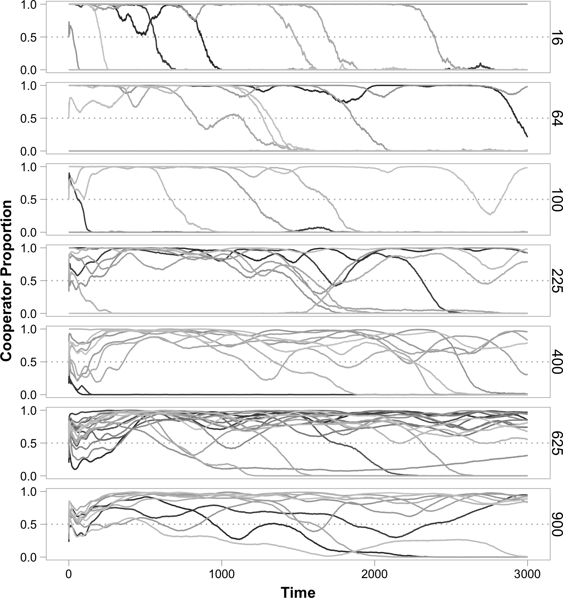

Dear Dr. Endler,

We are extremely grateful to you and the two anonymous reviewers for the thorough and thoughtful evaluation of our manuscript "Negative niche construction favors the evolution of cooperation".
The comments provided were very helpful and prompted changes that have greatly improved the manuscript.
In response to reviewer feedback, we have:

- Rewritten portions of the abstract, main text, figures, and table
- Performed simulations to elucidate the influence of several key parameters
- Performed simulations to explore a wider set of initial conditions
- Included additional results as supplementary information

Below, we address each of the comments individually.
Each reviewer comment is shown **TODO formatting details**, and our response is shown immediately below **TODO formatting details**.

\rule{\textwidth}{1pt}

# Editor

*Here are my own comments about what I think are the most important points made by reviewer 1:*

*He said "An important question for me is whether this mechanism really stabilises cooperation or merely slows its decline."  He also said "Does that fact that p is set to 0.5 at the start of the simulations make this paper really about the persistence of cooperation rather than its evolution? To show the latter, would the authors not consider testing their model with an initial p of 1/800 i.e. a single mutation? In how many such runs does cooperation then persist?"
There is a bit of a terminology mess here.  By "evolution" he means the origin and
spread of cooperation, which would be the case if the frequency increased from a very small value (as he said).  You started at 0.5 which might mean it is indeed more about maintainance than spread from a small value.  Regardless of what you call it, you actually cannot say that you are showing a mechanisms of stabilization unless you start at BOTH a small and a large value.  Stabilisation means that there is some kind of stable equilibrium. You cannot tell from only starting at 0.5, as you will see from any population genetics textbook.  Please fix this by starting at both a low and a high initial frequency.   This is the main reason I'm calling this a major revison.  Easy to do and report on but it will take more time than just rewriting.*

We thank the reviewer and editor for this suggestion, which has stimulated some interesting findings.
We have addressed this issue in two ways.
First, we have run baseline simulations sweeping across initial cooperator proportions, showing that cooperators perform well from many starting proportions, but cannot invade from rarity.
Second, we ran additional simulations in which the benefit of cooperation was increased, and found reliably that cooperators can invade from initial absence after first arising via mutation.
In such cases, cooperators are likely to persist at reasonable proportions indefinitely.
Here again, negative niche construction is a key ingredient.
We think this result greatly strengthens the paper, and we are thankful for the suggestion.

**TODO: should we include the invasion plot here as well?**

\begin{center}\rule{5in}{0.2pt}\end{center}

*Here is another statement by this reviewer which I don't agree with: "Is this really negative niche-construction - "niche-constructing acts that, on average decrease the fitness of the niche-constructing organisms" - in the model, the niche-construction shifts the optimum value in the environment, but does not directly reduce fitness of the niche-constructors - instead it makes a higher relative fitness possible for others."  Evolution is about relative fitness, not absolute fitness (his comments are about absolute fitness), so, given that you have shown increased fitness of others but unchanged for the target, it's relative fitness (relative to the others)
HAS declined and you DO have negative niche construction.  Maybe just make this more explicit.*

We thank the editor for the clarifying comment.
We have now emphasized the role of relative fitness in our definition of negative niche construction.
The very end of the Box now reads:

>We call this negative niche construction, as the actions of constructors increase the fitness of a different genotype and thereby lower their own relative fitness.

\begin{center}\rule{5in}{0.2pt}\end{center}

*Please give more thought and discussion about the external and the constructed environments, they are not necessarily coupled, in fact in some ways this is the entire point of niche construction.*

Our intention was to frame these "environments" as separate for this simple model.
This way the role of exogenous and endogenous forces could be easily distinguished.
Both environments are not explicitly modeled as dynamic variables here (but rather wrapped into the selection of different alleles).
In a future model, we would like to model the environment explicitly (e.g., as a resource), where both constructive activities and external forces could change its state.
We have elaborated this future extension in our Discussion:

>To study how regulatory traits such as these evolve, we could instead represent the niche explicitly, allowing it to have its own dynamics.
A representation in which the "niche" is simultaneously influenced by external forces and the actions of organisms would more closely resemble many natural systems.

\begin{center}\rule{5in}{0.2pt}\end{center}

*As reviewer 2 says, "More robust justification for imposing a ~90% death rate on each subpopulation every generation" is badly needed!  This is rather unrealistic, and makes the entire model rather dubious, unless you can show the same effects with a more realistic death rate (say 30%).*

We have now swept through a number of death rates and showed that indeed as survival rates from dilution increase, cooperators fare worse (as predicted by the reviewer).We have tried to justify our baseline dilution survival rates in our response below.
It is worth mentioning that some initial lift in cooperator population is robust to the level of dilution.
We have added a section to our Supplemental Materials that discuss this parameter in detail.

\rule{\textwidth}{1pt}

# Reviewer 1

*This paper extends an existing agent-based model of the evolution of cooperation through the effect of cooperation producing higher population densities, therefore higher absolute number of mutations and hence higher numbers of beneficial adaptations to what is termed the "external" environment, to incorporate the concept of niche construction and argue that what the authors term 'negative niche construction', but what I feel might be better represented as niche creation or extension, can actually stabilise costly cooperation in metapopulations.*

*I found a lot to like in the paper and I definitely think it should be published. The model is a really neat (in the sense of elegant enough to facilitate real understanding, which is not something you can say about all agent-based models) take on the problem of coming up with tractable models to explore complex evolutionary interactions like niche construction. The main finding is clear, and the whole package is very nicely presented. I thought the analysis of the contrast between ecological (invasion) and evolutionary effects was particularly nice. There is nothing I strongly disagree with, but I do have a series of thoughts and questions about the paper which the authors could reflect on, along with some specific points where I felt presentation could be improved or clarified.*

## General Questions

*An important question for me is whether this mechanism really stabilises cooperation or merely slows its decline. I look at Figure 1C and I see that while p is still non zero by T=3000, it is clearly declining. Would it eventually hit zero again or is an equilibrium achieved? Is the use of 'indefinitely' on L305 justified? Perhaps this is more of a presentation thing, because in Figure 2A it is clear that there are many populations with high levels of cooperation, albeit with a lot of oscillation - for me this begs the question of how big the metapopulation needs to be to buffer effectively against this degree of stochasticity…*

Because our mechanism depends on adaptation to the environment via mutation, it is inherently stochastic.
We see this in Figure 2A, where cooperators were driven to extinction in four replicate populations.
In these cases, defectors happened to adapt faster than cooperators, and quickly spread to fixation.
As the reviewer notes, these results drive the decrease in average cooperator proportion across replicate populations that we see in Figure 1C (which motivated us to show data for individual replicates in all subsequent figures).

Because negative niche construction creates a never-ending "adaptive race", the possibility of cooperator loss through defector adaptation is also never ending.
However when cooperators maintain numerical dominance, a critical factor for the Hankshaw effect, they are more likely to be the first to adapt.
This is how cooperation was maintained in the majority of replicate populations shown in Figure 2A.

We have removed "indefinitely" in the places where they originally appeared in the manuscript.
However, we do note that under parameter settings that allow cooperators to invade (see our response to the following point below), our use of the term may be justified.

There does indeed seem to be an effect of increasing population size on stabilizing cooperation
We have done some preliminary exploration of this effect (see figure below); however, for larger population sizes, these simulations take quite a while to run, and we would more time to execute a thorough analysis.
We are happy to pursue this further if the reviewer deems this important.

\begin{center}\rule{5in}{0.2pt}\end{center}

*Does that fact that p is set to 0.5 at the start of the simulations make this paper really about the persistence of cooperation rather than its evolution? To show the latter, would the authors not consider testing their model with an initial p of 1/800 i.e. a single mutation? In how many such runs does cooperation then persist?*

This is a very important point that should have been addressed in the original manuscript.
To better understand this parameter, we have run additional simulations in which the initial proportion of cooperators were widely varied.
The results of these simulations are included as Supplementary Material.
In summary, we do not find that cooperators can invade from rarity over the timescales that we consider, under our original parameters.
However, one small alteration (lifting $S_{max}$) does allow cooperators to invade from an initial absence ($p_0=0$) after arising via mutation.
We found these outcomes so interesting that we have added a new section to the Results (referenced Figure included below):

**TODO: also include figure from sweep of initial cooperator proportion?**

>**Negative Niche Construction can Promote Cooperator Invasion**
>
>The majority of the results shown above have focused on the maintenance of cooperation.
>Specifically, cooperators have started at---and maintained---reasonably high proportions in the populations.
>In the previous section, we considered cooperator invasion; however, the cooperators began in their own single subpopulation without defectors.
>It remains to be seen whether cooperators can invade from extreme rarity.
>In a population in which cooperators are initially absent, can cooperators that arise by mutations increase in frequency?
>With baseline parameters (Table 1), cooperators tend not to invade over 3000 cycles when the initial cooperator proportion is low (see Supplemental Materials).
>However, when the benefits of cooperation are increased ($S_{max}=8000$), cooperators can readily invade and reach high proportions (Figure 5A).
>This result depends on the presence of niche construction.
>Without the selective effects introduced by negative niche construction, cooperators cannot invade (Figure 5B).

![**Niche Construction and the Invasion of Cooperation.** The proportion of cooperators present in each of 50 replicate populations is shown for the duration of simulations ($T=5000$). Baseline parameters are used, except for $S_{max}=8000$, and the initial proportion of cooperators in each population is zero ($p_0=0$) (but can arise via mutation) (**A**) Cooperators invade and reach very high proportions when niche construction affects selection ($N=50$). (**B**) Without niche construction ($\epsilon=0$), cooperators do not invade ($N=50$).](../figures/cooperator_invasion.png)

\begin{center}\rule{5in}{0.2pt}\end{center}

*Is this really negative niche-construction - "niche-constructing acts that, on average decrease the fitness of the niche-constructing organisms" - in the model, the niche-construction shifts the optimum value in the environment, but does not directly reduce fitness of the niche-constructors - instead it makes a higher relative fitness possible for others.*

The effect of niche construction is to lower the relative fitness of the constructor (rather than its absolute fitness).
Niche construction increases the absolute fitness of another type, thus decreasing the *relative* fitness of the niche constructing type.
By constructing an environment that favors another type, the niche constructing type puts itself at a selective disadvantage if a favored type arises by mutation.
Thus, even if the sole effect of niche construction is to raise the absolute fitness of another type relative to the focal constructor, this would qualify as a case of "negative niche construction" due to a lowered relative fitness.

The distinction between absolute and relative fitness and how they relate to niche construction has previously been discussed.
In his review of Odling-Smee, Laland, and Feldman's *Niche Construction: The Neglected Process in Evolution*, Okasha noted that the authors did not explicitly state whether positive and negative niche construction affected absolute or relative fitness (doi: [10.1007/s10539-005-0431-3](http://dx.doi.org/10.1007/s10539-005-0431-3)).
Laland, Odling-Smee, and Feldman responded: "In all cases in our models we are referring to relative fitness which is natural since we make standard population genetic assumptions..." (doi: [10.1007/s10539-004-6834-8](http://dx.doi.org/10.1007/s10539-004-6834-8)).
We have tried to make this clearer in our main text.
At the end of the legend of Box 1, we now say:

>We call this negative niche construction, as the actions of constructors increase the fitness of a different genotype and thereby lower their own relative fitness.

\begin{center}\rule{5in}{0.2pt}\end{center}

*There is a separation in the model between the "external" environment and the "constructed" environment, neither of which are modelled independently; rather they are implied from the way that the genetic makeup of organisms affects their fitness. This seems like a weak point of the model given that this separation is clearly an artificial construct - it would help the paper if the authors could give some thought to justifying this distinction - why doesn't niche construction affect the "external" environment. For example, is this a way that host/parasite interactions have been previously modelled? Further to this point, adaptation is usually associated with some degree of genetic load - i.e. the difference between optimal and actual genotypes in a given environment (e.g. L255). Can the authors say anything about whether an assumption of no genetic load is critical to their findings, or whether they think it is implicitly accounted for in their model in some way I have missed?*

In natural settings, environmental change is often brought about by exogenous factors (e.g., changing seasons) as well as endogenous factors (e.g., niche constructing behaviors).
Many of its proponents argue that niche construction can substantially influence the evolutionary process, and this model is our first attempt at identifying how niche construction might play a role in cooperation.
The distinction that we make in the model between external and constructed environments allows us to directly address the effects of niche construction by comparison with a previous model in which only exogenous factors played a role.
We see this as a distinct advantage, as identifying and quantifying the selective feedbacks that niche construction introduces could otherwise be challenging.

We have added a sentence in the Methods to offer motivation for this separation:

>While the separation between exogenous and endogenous environmental change may not always be as clearly differentiated in natural systems, it allows us to directly explore the effects of niche construction.

As described in the Discussion, we realize that implicitly modeling niche construction and external selection pressures through the genetic determination of fitness has certain limitations.
One of the principal limitations is the lack of a rich interplay between exogenous and endogenous influences on the environment.
An explicit representation of the environment (e.g., as a dynamic resource or a coevolving partner) would certainly enrich a model such as ours and could permit exploration of abiotic states or host/parasite interactions.
We have added some text to our Discussion to make these extensions clearer:

>To study how regulatory traits such as these evolve, we could instead represent the niche explicitly, allowing it to have its own dynamics.
>A representation in which the "niche" is simultaneously influenced by external forces and the actions of organisms would more closely resemble many natural systems.

In some sense, genetic load is an inherent part of our model.
We note that there will be a constant presence of deleterious mutations (e.g., mutations that introduce allele 0 back to any locus or mutations that introduce a non-zero allele that is inappropriate for the niche constructed by the population), which will make the actual genotypes non-optimal.
However, more importantly, the negative niche construction scenario is contributing to a continual mismatch between the actual constructing genotypes and the genotype that would best respond to the constructed niche.
This mismatch is the engine that keeps the adaptive opportunities omnipresent, thus allowing for perpetual evolution by the Hankshaw effect.

\begin{center}\rule{5in}{0.2pt}\end{center}

*The setup of the circular chromosome and circular fitness implications is mathematically neat - however, it seems like a very specific set of assumptions about gene/environment interactions (for example, only when the modulus of L/A is non-zero) and one always worries about the generality of insights based on such a specific system. Can the authors provide any more information about where these assumptions might be met in nature, and/or what range of conditions or assumptions are needed for their insights to hold.*

While we would not claim that our implementation represents any specific system in nature, it does allow adaptation to proceed in an unlimited manner, similar to an unending co-evolutionary arms race.
Alternate implementations, such as explicitly modeling adaptation using ever-increasing numbers of loci, would be computationally costly---likely prohibitively so.
This model is our compact attempt to capture the potentially never-ending co-evolution of organisms and their environment in a computationally tractable manner.

\begin{center}\rule{5in}{0.2pt}\end{center}

*Increased population density has only positive effects here - but density can also bring costs - this is ignored in the linear population growth of Eq 4; is it possible to say anything about how much cost can be borne before the effect disappears?*

This is an important point.
We have expanded our model to explore different forms of population size increase as a function of cooperator proportion.
As detailed in the Supplementary Material, we added an additional parameter to Equation 4, $\gamma$, to control whether the increases in population size accelerate ($\gamma > 1$) or decelerate ($\gamma < 1$) as cooperators become more abundant.

The following figure shows how these different forms of density-dependent benefits affect evolutionary trajectories in comparison to our baseline conditions ($\gamma = 1$).
Accelerating benefits tend to dampen oscillations and increase the proportion of cooperators in the replicate populations over time, while decelerating benefits tend to increase the magnitude of oscillations, allowing defectors to dominate.
Interestingly, these large oscillations also allow cooperators to rapidly increase in frequency in a number of instances, even when rare.

 {#fig:nonlinear_benefits_int}

## Minor Issues

*L16 I thought the description of the Hammerlund paper was too long for the abstract.*

We have now shortened this description in the abstract.
It now reads as follows:

>By benefitting others at a cost to themselves, cooperators face an ever present threat from defectors---individuals that avail themselves of the cooperative benefit without contributing.
A longstanding challenge to evolutionary biology is to understand the mechanisms that support the many instances of cooperation that nevertheless exist.
Hammarlund et al. recently demonstrated that, in spatially-structured environments, clustered cooperator populations reach greater densities, which creates more mutational opportunities to gain beneficial non-social adaptations.
Cooperation rises in abundance through hitchhiking with these mutations.
However, once adaptive opportunities have been exhausted, the ride abruptly ends as cooperators are displaced by adapted defectors. 
Using an agent-based model, we demonstrate that the selective feedback that is created as populations construct their local niches can maintain cooperation indefinitely.
This cooperator success depends specifically on negative niche construction, which acts as a perpetual source of adaptive opportunities.
As populations adapt, they alter their environment in ways that reveal additional opportunities for adaptation.
Despite being independent of niche construction in our model, cooperation feeds this cycle.
By reaching larger densities, populations of cooperators are better able to adapt to changes in their constructed niche and successfully respond to the constant threat posed by defectors.
We relate these findings to previous studies from the niche construction literature and discuss how this model could be extended to provide a greater understanding of how cooperation evolves in the complex environments in which it is found.

\begin{center}\rule{5in}{0.2pt}\end{center}

*L41 I think cooperation should be precisely defined here, with respect to the distinction between cooperation for mutual benefit (albeit with risk of defection), and altruism, whereby altruists always 'lose out' in the short term by their behaviour.  Which precisely do the authors think they are describing - it seems to me that it partly depends on the model parameters, but it is a bit difficult to tease out with the collective benefits conferred by Equation 4, but it seems more like altruism to me, and that's what the authors seem to suggest ('sacrificing their wellbeing to help others')?*

The reviewer is asking a good question, and the answer is a bit complicated.
Our form of cooperation satisfies one definition of altruism (traditionally used in the multi-level selection theory literature).
With additional constraints, this type of altruism is related to other types of altruism (e.g., traditionally used in the inclusive fitness theory literature).
In response to the reviewer’s comment on L172 / Eq 4 below, we have added to the Supplement a derivation of an expression for the expected absolute fitness for a genotype within a subpopulation of a certain genetic composition.
Using this expression, we can connect our form of cooperation to multilevel altruism.
The following is included in the Supplementary Material:

>**Altruism** There have been several different definitions of altruism, with complicated connections between them (see [Kerr et al. (2004)](http://dx.doi.org/10.1016/j.tree.2003.10.004)).
In our model, we have a form of "multilevel altruism", which requires altruists have lower fitness within a subpopulation, but subpopulation productivity increases with altruist proportion.
To see this, consider a subpopulation with only two genotypes $g_c$ and $g_d$, where $a_{0,g_c} = 1$, $a_{0,g_d} = 0$, and $a_{l,g_c} = a_{l,g_d}$ for all $l \in \{1, 2, \ldots, L\}$.
Specifically, genotype $g_c$ refers to a cooperator, genotype $g_d$ refers to a defector, and otherwise the two genotypes are identical.
By Equation S2, $W_{g_{c}} < W_{g_{d}}$, which implies $\omega_{g_{c}} < \omega_{g_{d}}$.
That is, the cooperator always has fewer expected number of offspring than an isogenic defector within its subpopulation.
However, Equation S3 guarantees that the productivity of the subpopulation increases with the proportion of cooperators.
Thus, cooperators qualify as multilevel altruists.
With additional constraints on the parameters, cooperation could also satisfy other definitions of altruism (e.g., "individual-centered altruism" or "focal-complement altruism", see [Kerr et al. (2004)](http://dx.doi.org/10.1016/j.tree.2003.10.004)).
However, to keep things general, we have not assumed these constraints.
To avoid confusion between these different forms of altruism, we have opted to use the more general term “cooperation” in our manuscript.

In the Methods section of the main text, we now refer the reader to the Supplement for this discussion of the connection to altruism:

>Because cooperators improve group productivity (Equation 4) but drop in proportion within mixed groups, this form of cooperation would also qualify as "multi-level altruism" (see Supplementary Material and [Kerr et al. (2004)](http://dx.doi.org/10.1016/j.tree.2003.10.004)).

\begin{center}\rule{5in}{0.2pt}\end{center}

*L69 Personally I find the Tom Robbins analogy a bit of a stretch and while I know the literature in question many will not so it's kind of unclear what's added here; it's also potentially confusing - Sissy's thumbs help her hitchhike as much as anyone else, so it's not clearly paying a cost to help others.*

We fear we may have been a bit unclear about the meaning of the "Hankshaw effect".
This refers to any property of an allele that makes it more likely to increase in frequency via hitchhiking.
Thus, this need not refer to an allele encoding cooperation.
Indeed, in our other manuscript, we show how spite evolves through a Hankshaw effect.
Also, the Hankshaw effect need not be mediated through social interactions: a mutator allele could be said to evolve by a Hankshaw effect if it becomes associated with a beneficial mutation that it made more likely.

As a side point, Sissy’s oversized thumbs were described in the novel as a hindrance to everyday activities, such as putting on clothing, and a limitation to her career choices (thus, this property would be seen as ostensibly deleterious).
So while Sissy’s thumbs share a cost that is analogous to cooperation (and spite and mutators), we did not intend to attach further connections (e.g., that Sissy’s thumbs somehow help others).
The heart of the Hankshaw effect is that the allele has a positive effect on hitchhiking probability (despite its direct fitness effects).
We have worked to clarify the description of the Hankshaw effect, highlighting that any trait---not just cooperation---can prolong its survival by increasing the opportunity to hitchhike

The most relevant paragraph in the Introduction has been modified to read:

>Hammarlund et al. (2015) recently showed that in spatially-structured populations, the "Hankshaw effect" can give cooperators a substantial leg up on defectors in an adaptive race.
Inspired by a fictional character in Tom Robbins' *Even Cowgirls Get the Blues*, the Hankshaw effect describes how a trait can proliferate by actively creating opportunities to hitchhike along with other highly beneficial traits.
Sissy Hankshaw was born with extremely oversized thumbs.
Although her thumbs were an impairment to everyday activities, they made her a prolific hitchhiker.
Similarly, although cooperation is costly, cooperators can enjoy increased opportunities to hitchhike.
Specifically, cooperators increase their local population density, making them more likely to acquire beneficial mutations.
By hitchhiking along with these adaptations, cooperation can rise in abundance.
Nevertheless, this advantage is fleeting.
As soon as the opportunities for adaptation are exhausted, cooperators are once again at a selective disadvantage against adapted defectors that arise via mutation.
However, cooperation can be maintained when frequent environmental changes produce a steady stream of new adaptive opportunities (Hammarlund et al. (2015)).
Although organisms typically find themselves in dynamic environments, the frequency and regularity of these changes might not ensure long-term cooperator survival.

\begin{center}\rule{5in}{0.2pt}\end{center}

*L151 Eq (1) - I think a one sentence explanation of what this equation does would save readers some effort in understanding here.*

This is an excellent suggestion.
We have added two examples to the manuscript that we hope will help clarifying how this function works and how it relates to the two "circular" sets used in the model.

>For example, $\beta(3, 5)$ is 2, while $\beta(1, 5)$ is 5.

\begin{center}\rule{5in}{0.2pt}\end{center}

*L157 Why is the subscript 'g' needed here? I can't see where this is ever summed over in the subsequent equations, so the notation might be overcomplicated here.*

We have removed the 'g' subscript from the main text.
However, we continue to use the 'g' subscript in the Supplementary Material to indicate a particular genotype as before.

\begin{center}\rule{5in}{0.2pt}\end{center}

*L172 / Eq 4 The costs and benefits of cooperation are always crucial in models like this, but while the costs are clear, the benefits are spread out using this equation. I feel like this should be clarified a little more - can the effects of this equation be reproduced in equation 2 such that both the costs and benefits of cooperation are explicitly expressed through effects on individual fitness?*

This is a good point, and motivated us to derive a measure of expected absolute fitness of a genotype within a subpopulation that incorporates both costs and benefits.
We have now added the following information to the Supplement:

>**A Measure of Expected Absolute Fitness within a Subpopulation**
>
>For the following description, we ignore mutation and focus on selection in our model. We define fitness of genotype $g$ within a subpopulation to be:
>
>$$ W_g = z - c a_{0,g} + \delta \sum_{l=1}^{L} I(a_{l,g}) + \epsilon \sum_{l=1}^{L} n(\beta(a_{l,g}, A), \beta(l, L)) $$
>
>where $a_{l,g}$ is the allelic state at locus $l$ of genotype $g$, and all other terms are described in the main text.
>We let $N_g$ be the number of individuals in the subpopulation with genotype $g$.
>After selection, the expected fraction of the subpopulation that has genotype $g$ is:
>
>$$ F_{g} = \frac{N_g W_g}{\sum_{i \in \mathbf{G}}^{} N_i W_i} $$
>
>where $\mathbf{G}$ is the set of all genotypes in the subpopulation of interest.
>Total subpopulation size after selection is
>
>$$ S = S_{min} + \frac{\sum_{i \in \mathbf{G}}^{} N_i a_{0,i}}{\sum_{i \in \mathbf{G}}^{} N_i} (S_{max} - S_{min}) $$
>
>where the proportion of cooperators is $p = (\sum_{i \in \mathbf{G}}^{} N_i a_{0,i})/(\sum_{i \in \mathbf{G}}^{} N_i)$.
>Thus, if $X_g$ is a random variable giving the number of individuals after selection with genotype $g$, then
>
>$$ \text{Pr}\{X_g = x\} = \binom{S}{x} (F_g)^x (1-F_g)^{S-x} $$
>
>where $x \in {0,1,2,\ldots,S}$. The expected number of individuals of genotype $g$ after selection is:
>
>$$ E[X_g] = F_g S $$
>
>The quantity
>
>$$ \omega_g = \frac{E[X_g]}{N_g} $$
>
>serves as the (expected) absolute fitness of genotype $g$ in the subpopulation of interest.
>We note that this absolute fitness value only depends on the genotypic composition of the subpopulation (the members of the set $\mathbf{G}$ and their numbers in the subpopulation) and the parameters of the model ($z$, $c$, $\delta$, $\epsilon$, $S_{min}$, $S_{max}$).
>By summing $E[X_g]$ over all the subpopulations (which can differ in genotypic composition), and dividing by the sum of $N_g$ over all subpopulations, we can arrive at the expected absolute fitness of genotype $g$ at the scale of the entire metapopulation.
>
>We note that mutation will complicate this derivation because a fraction of the individuals with genotype $g$ after selection will mutate into another genotype, while a fraction of other genotypes may mutate into genotype $g$.
>At a metapopulation scale, migration does not change the absolute fitnesses of genotypes, however, it can alter genotypic composition of subpopulations and therefore affect the absolute fitnesses of genotypes in the next generation.

\begin{center}\rule{5in}{0.2pt}\end{center}

*L185 Just a point of clarification - mutation can result in "no adaptation" right? Is there a reasons for the {0}U{1,2,3…} notation rather than the simpler {0,1,2,3,…} - the union operator doesn't seem to serve any purpose here?*

We have removed the union operation in favor of the simplified set $\{0, 1, \ldots, A\}$.
The original intent was to highlight that mutation could result in a $0$ allele, which would be a loss of function.

\begin{center}\rule{5in}{0.2pt}\end{center}

*L192 why use boundaries rather than toroid?*

While we realize that using a bounded lattice may introduce effects at the edges, we chose not to use a torus primarily to maintain consistency with the Hammarlund et al. paper.
When exploring the model parameters for that work, we did not find significant differences between a bounded lattice and one with periodic boundaries for the population sizes used in both projects.
Our primary motivations for having boundaries were to simplify both the description and visualization of space (and distances), particularly for those not accustomed to thinking about toroidal surfaces.

\begin{center}\rule{5in}{0.2pt}\end{center}

*L202 Is this right? - if each individual remains with probability $d$ then with $d=0.1$ as per Table 1, then the population is reduced to < Smin (800) even when at its maximum size ($0.1 Smax = 200$) - why parameterise in this case, rather than just choosing Smin individuals at random?*

This is correct---the bottleneck introduced at the end of each cycle reduces each subpopulation to fewer than $S_{min}$ individuals.
In the next cycle, each subpopulation then grows to its carrying capacity.
During growth, mutations are introduced, and growth rate depends on fitness.
This approach is more conservative than what the reviewer suggests.
If we instead chose $S_{min}$ individuals at random, we anticipate two outcomes.
First, the evolutionary process would be slowed down, as mutations would occur less frequently due to reduced growth.
Second, defector populations would be especially burdened by this, so the Hankshaw effect would be exaggerated.

\begin{center}\rule{5in}{0.2pt}\end{center}

*L210 "performED" and I would argue results should be past tense throughout.*

We made the stylistic choice to use present tense in the results section with the idea that it is more inviting to the reader.
There is some precedent for using the present tense in this journal, particularly when describing simulation results (e.g., [Antonovics et al. (2015)](http://dx.doi.org/10.1007/s10682-015-9775-6)).
However, if this stylistic decision is a hindrance, we would be willing to change tense.

\begin{center}\rule{5in}{0.2pt}\end{center}

*L262 The authors state that setting L=A changes the niche construction from positive to negative. I am afraid I completely missed the reasoning here and I think the paper would be improved if it were spelled out more clearly why this parameter setting induces positive niche construction (i.e. an increase in constructor fitness by their construction activity).*

We have updated the text to add clarity.
We now describe how changing this value alters niche construction by fully-adapted types as well as reference Box 1, Part C, which illustrates this scenario (we do note that setting $L=A$ changes niche construction from negative to positive).
The relevant text now reads:

>When negative niche construction is removed (by setting $L=5$, $A=5$; see Box 1, Part C), cooperators are again driven to extinction after an initial lift in abundance (Figure 2C).
>Here, a fully-adapted type constructs a niche that favors itself.
>When this occurs, a fully-adapted cooperator is at a selective disadvantage against fully-adapted defectors, which do not incur the cost of cooperation."

\begin{center}\rule{5in}{0.2pt}\end{center}

*L386-388 I think this point about representing the niche, or environment, explicitly, is more important than the attention it is given here...*

To address this point as well as one of the points above, we have now added the following to our discussion:

>To study how regulatory traits such as these evolve, we could instead represent the niche explicitly, allowing it to have its own dynamics.
A representation in which the "niche" is simultaneously influenced by external forces and the actions of organisms would more closely resemble many natural systems.

\begin{center}\rule{5in}{0.2pt}\end{center}

*L410-411 - this doesn't appear to be a proper sentence.*

This has been addressed in the current manuscript with the addition of an "of" to identify what is being produced.

\begin{center}\rule{5in}{0.2pt}\end{center}

*Table 1 - aswell as base values, it would be useful to show which further values were explored for each parameter, to judge where parameters space has been explored.*

Table 1 has been given an additional column listing the additional parameter values tested.
We thank the reviewer for the nice suggestion.

\rule{\textwidth}{1pt}

# Reviewer 2

*This paper shows that negative niche construction can create the opportunity for new adaptation and maintain a costly trait that increases local population density in a population where it would otherwise be driven to extinction.*

*The idea is interesting and I am happy to recommend publication with some minor changes and with some small clarifications.*

## General Questions

*The definition of cooperation used here appears to be that cooperation is a costly behaviour that increases local population density. The authors do briefly mention the negative aspects of high local population density in terms of increased competition on pages 18/19 but this discussion does not extend to the model. In fact, the authors avoid this issue by diluting the population 'to allow growth in the next generation'. More robust justification for imposing a ~90% death rate on each subpopulation every generation may be needed as it could favour the cooperative allele substantially. What would the authors expect to see if local competition was explicitly modelled?*

We are grateful to the reviewer for drawing our attention to the lack of justification or clarification of the 90% death rate used in the original manuscript.
Our primary motivation for selecting this rate was to maintain consistency with, and allow comparison to, the model and results presented in the Hammarlund et al. work (and ongoing microbial experiments).
While a 90% dilution may be excessive for some natural populations, it is not necessarily so for others.
For example, 95-99% of the *Vibrio harveyi* residing in the bobtail squid's light organ are expelled daily (Lee and Ruby, 1994).

To address the reviewer's concern, we have performed additional simulations in which a wide range of dilution factors were used.
Our results, shown below, have been added as Supplementary Material.
Note that dilution affects the amount of growth, and therefore the number of mutational opportunities, experienced during each simulation cycle.
To compensate, we have rescaled Time in this figure to show cooperator proportions for equivalent numbers of births across dilution treatments.

![**Effect of Subpopulation Dilution.** Each panel shows the proportion of cooperators present for the duration of simulations with different dilution survival probabilities ($\sigma_d$), shown on the right. Because thinning affects the number of offspring produced during each cycle, and hence the number of mutational opportunities to gain adaptations, simulations proceeded until populations had reached $2.8 \times 10^9$ births, which was the average number of births that occurred in simulations with baseline parameter values over 3000 cycles. As the probability of survival increases, defectors pose a greater threat. Here, lines show the trajectories of replicate populations.](../figures/dilution-births.png)

As shown in the Figure, cooperator survival diminishes as more individuals survive the periodic dilution.
These results confirm the reviewer's prediction that dilution often does favor the cooperative allele and align with previous work (e.g., [Brockhurst (2007)](http://dx.doi.org/10.1371/journal.pone.0000634)).

We have also extended our model to address the negative aspects of increasing subpopulation density.
As detailed in the Supplementary Material, we added an additional parameter to Equation 4, $\gamma$, to control whether the increases in population size accelerate ($\gamma > 1$) or decelerate ($\gamma < 1$) as cooperators become more abundant.
The following figure shows how these different forms of density-dependent benefits affect evolutionary trajectories in comparison to our baseline conditions ($\gamma = 1$).
Accelerating benefits tend to dampen oscillations and increase the proportion of cooperators in the replicate populations over time, while decelerating benefits tend to increase the magnitude of oscillations, allowing defectors to dominate.

![**Effect of Non-Linear Cooperative Benefits.** Cooperators rapidly rise in frequency when the benefits have accelerating returns ($\gamma > 1$). When the increases in subpopulation carrying capacity have diminishing returns ($\gamma < 1$), the proportion of cooperators oscillates more frequently, which can allow defectors to fix. Here, each panel shows cooperator proportion for the duration of simulations in which the relationship between cooperation and increases in carrying capacity were varied ($\gamma$, indicated on the right). Lines show the trajectories of replicate populations.](../figures/nonlinear_benefits.png)

\begin{center}\rule{5in}{0.2pt}\end{center}

*Could 'adaptation to external environment' be rolled in to baseline fitness? It seems that 0 alleles (except at the cooperation locus, of course) are always selected against and should drop out of the population quite quickly. What would change if the third term in equation (2) were omitted?*

This is a good question.
It is indeed unlikely that non-zero alleles would be maintained for very long, so we agree with the reviewer on this point. Doing so would also simplify the model, which we would welcome.

However, to maintain consistency with our earlier model described in the Hammarlund et al. paper, we have opted to keep this additional component of fitness.
We believe that doing so allows us to clearly differentiate our results---thus directly highlighting the effects of niche construction---from this previous work.

Additionally, we know that adaptation to the external environment is important in this model.
As shown in the figure below, cooperation is quickly lost without this fitness component.
This is likely because the fitness effects of adaptation to the external environment are direct, while the fitness effects associated with niche construction are density dependent.
The fitness advantage displayed by a type adapted to the environment helps to jump start niche construction and thus the maintenance of cooperation by niche construction.

It might be possible to achieve this effect without the third term in Equation 2 by introducing adapted types at the onset of simulations and "jump-starting" niche construction and adaptation, but we have not explored this.

\begin{center}\rule{5in}{0.2pt}\end{center}

*Migration could be explained in a bit more detail. For example, does migration occur symmetrically in order to avoid some subpopulations stochastically exceeding S_max? If not, how is this avoided? The text on the bottom of page 6 and the top of page 7 suggests that the rate of migration depends on success or fitness. Is this reflecting frequency dependence only or some other mechanism?*

We agree with the reviewer's comment: migration was not defined clearly enough in the manuscript.
We have made changes that directly address both of the questions raised.

First, we have stated in the Methods section that subpopulations can exceed $S_{max}$ individuals immediately following the migration stage.
We then add that this is temporary, as dilution immediately follows, which reduces the population size.

As for the second point, our original wording in the model overview could have easily misled readers, giving the impression that migration was affected by adaptation or fitness, which is not true.
We have updated this to indicate that migration occurs independent of genotype fitness.

\begin{center}\rule{5in}{0.2pt}\end{center}

*Finally, if I understand correctly, the force maintaining cooperation is a constant opportunity to adapt and maintain the benefit of having a large local population to generate useful adaptations. Is there a fundamental difference between the way in which this is modelled here (as a feature of the niche constructing genotypes of the individual agents) and modelling this as a straightforward variable or fluctuating environment?*

This summary is correct---cooperation can be maintained when two features are present: there must be adaptive opportunities, and cooperators must be more likely to gain these adaptations.
In our previous work (Hammarlund et al. 2015), we demonstrated that cooperation can be maintained when environmental change occurred periodically.
But timing is critical.
The period between changes in the environment must not exceed the time for the population to fully adapt.
Otherwise cooperation goes to low proportions as fully adapted defectors dominate.
Thus, niche construction can be seen as a way to protect cooperation from long periods between changes in the external environment.

## Minor Issues

*The labelling is a bit difficult to follow at times. I would suggest representing the alleles with letters and the loci with numbers (or vice versa) if possible.*

We do understand that having two sets of integers can be difficult to follow.
While we did consider the well-justified suggestion to use letters and numbers to differentiate between these sets, we believe that doing so would further complicate the mathematical description.
This is due to our use of modular arithmetic for both alleles and loci (see Equation 1).

We have taken the following steps to minimize the possibility of confusion.
Where specific numbers are used in the manuscript, we have made sure that these values are always properly prefixed so that their role is clear.
In the detailed description of the model given in Box 1, we italicized the integers used to represent loci (and always prefixed them with a description).

\begin{center}\rule{5in}{0.2pt}\end{center}

*Line 196-197. Why not just seed the environment with sigma\*S(P_0) individuals rather than the two step process described here?*

This is a valid point that highlights an additional source of complexity in the model and its analysis.
We have chosen to include this two-step process for initiating populations to maintain consistency with the Hammarlund et al. paper.
The overall inclusion of this additional stochastic element allows us to compare both models with ongoing microbial experimental evolution experiments.
We note that because of this additional stochasticity, we are careful to differentiate between *actual* initial cooperator proportions from *expected* proportions ($p_0$) where appropriate.

\begin{center}\rule{5in}{0.2pt}\end{center}

*Line 261. Does this only happen when a type has fixed in the subpopulation?*

No, all types contribute to the constructed environment proportional to their abundances.

We have updated the manuscript to clarify this point.
In the instance noted by the reviewer, types are no longer described as having fixed.

\begin{center}\rule{5in}{0.2pt}\end{center}

*Line 265. Without qualification this sentence might be overstating things a bit!*

This statement was indeed overgeneralized and failed to place our results in the proper context.
We have appended an additional sentence that clarifies that negative niche construction is an important factor in the maintenance of cooperation by the Hankshaw effect and that it does so by creating adaptive opportunities upon which cooperation can hitchhike.
This now reads:

>Specifically, negative niche construction is key for maintaining cooperation by the Hankshaw effect. Here, cooperators escape invasion by hitchhiking along with adaptations to the constructed environment.

\begin{center}\rule{5in}{0.2pt}\end{center}

*Line 271 and others. At times the term 'population' used rather than subpopulation or metapopulation. This should be specified each time.*

This is a distinction that we have given much consideration.
For this manuscript, we chose to use *population* to refer to a collection of independent *subpopulations*.
This is instead of referring to a collection of *populations* as a *metapopulation*.
We have checked several additional times to make sure our usage is consistent throughout the manuscript.
In addition, there were a few places, such as the sentence referred to here, where the distinction was not immediately clear.
We have edited these instances to be more explicit.

\begin{center}\rule{5in}{0.2pt}\end{center}

*A concluding paragraph that discusses the topic more generally might be more fitting than ending on a discussion of host-symbiont interactions.*

We are grateful to the reviewer for this helpful comment.
We believe that doing so places this work in a larger context and makes it accessible to a wider audience.
A more general conclusion has been added.
It reads as follows:

>We have previously shown that a combination of non-social adaptation and population structure can favor the evolution of cooperation (Hammarlund et al. (2015)).
However, this "Hankshaw effect" was transient; without continual opportunities for adaptation (e.g., a changing environment), defectors eventually dominate.
Here, we explore one source for such continual opportunities: negative niche construction.
Specifically, the process of adaptation creates opportunities for further adaptation through niche constructive feedback.
In our model, the active role of the organism is paramount; not only does cooperative behavior make hitchhiking more likely given adaptive opportunities, but
these adaptive opportunities themselves are continually generated through the effects organisms have on their environment.

\rule{\textwidth}{1pt}

Once again, we deeply appreciate time and effort that you and the two reviewers have dedicated to our research and the constructive comments provided.
We hope you'll find that this manuscript has improved through our efforts to address these comments.
Please do not hesitate to contact us if we can clarify any of our responses above.

Thank you for your continued consideration of our manuscript. 

Sincerely,

Brian Connelly, Katie Dickinson, Sarah Hammarlund, and Ben Kerr

