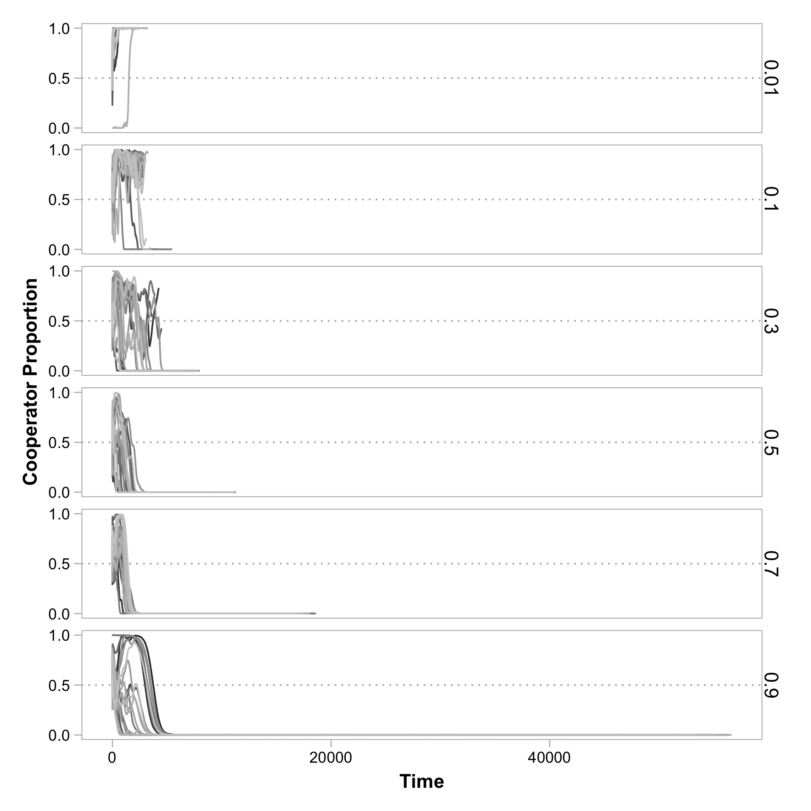
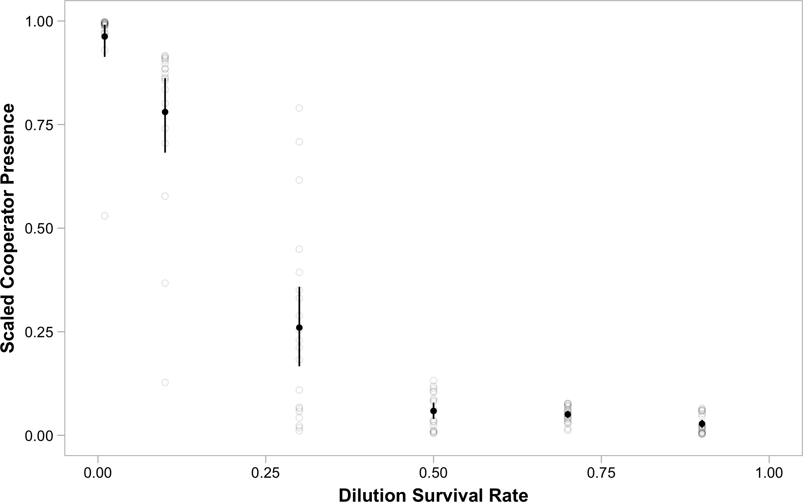
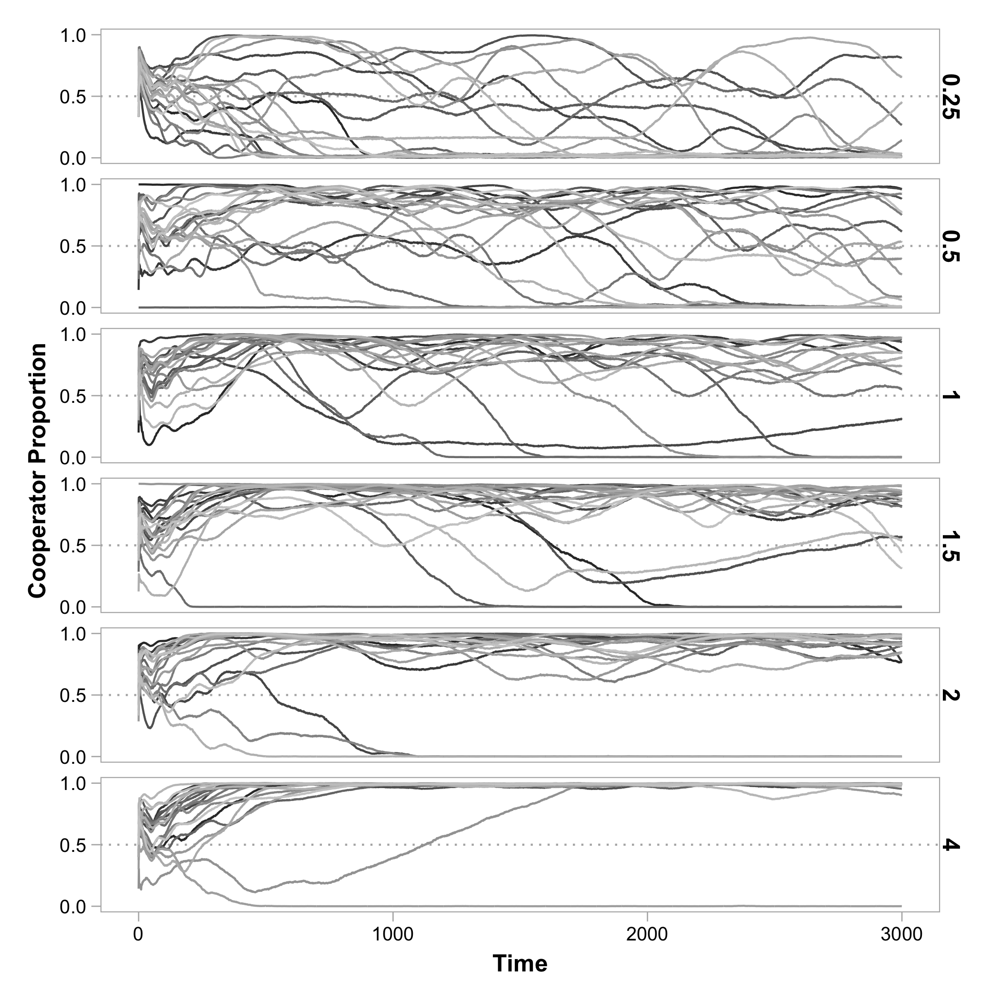
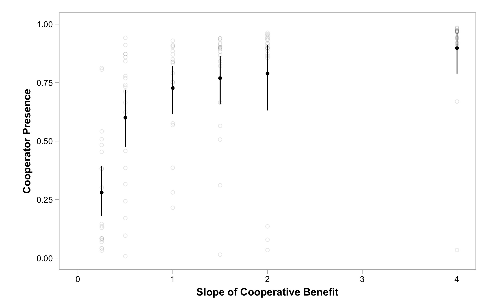

---
title: Supplementary Material for "Negative Niche Construction Favors the Evolution of Cooperation"
geometry: margin=1.0in
fontsize: 12pt

# TODO: metapopulation size
...

\renewcommand{\thefigure}{S\arabic{figure}}
\renewcommand{\theequation}{S\arabic{equation}}
\setcounter{figure}{0}
\setcounter{equation}{0}

# Effect of Initial Cooperator Proportion

For most of the simulations described both in the paper and in this supplement, populations are initiated with cooperators at proportion 0.5.
Here, we explore how this parameter affects the evolution of cooperation in our model by performing simulations with different initial cooperator proportions.
When rare, cooperators do not fare well under baseline conditions (Figure @fig:initial_coop_prop).
As the initial cooperator proportion increases, so do the number of replicate populations in which cooperation dominates.
Although cooperators continually arise via mutation, they do not invade when initially absent or very rare.

To quantify cooperator success during simulations, we use the area under the cooperator proportion curves.
As cooperators spend more time at high proportions, this *cooperator presence* metric increases.
Figure @fig:initial_coop_prop_int shows that cooperator presence increases as initial cooperator proportions become greater.

 {#fig:initial_coop_prop}

![**The Effect of Initial Cooperator Proportion on Cooperator Presence.** As the initial proportion of cooperators present in the population increases, the cooperator presence, or the area under the cooperator proportion curve, increases. Points represent the cooperator presence in replicate populations ($N=232$). The initial cooperator proportion is the proportion of cooperators present after the population is initialized and thinned. The solid line is a Loess curve fitted to these values with 95% confidence interval.](../figures/initial_coop_prop-integral.png) {#fig:initial_coop_prop_int}

# Effect of Dilution Factor

TODO: more description? See Figure @fig:dilution_births

![**Effect of Subpopulation Dilution.** Each panel shows the proportion of cooperators present in populations for a different dilution factor ($d$), which represents the proportion of individuals that survive the thinning that occurs during each simulation cycle. Because thinning affects the number of offspring produced during each cycle, and hence the number of mutational opportunities to gain adaptations, simulations proceeded until populations had reached $2.82\times 10^9$ births, which was the average number of births that occurred in simulations with baseline parameter values. TODO description of results](../figures/dilution-births.png) {#fig:dilution_births}

 {#fig:dilution_time}

 {#fig:dilution_births_int}

# Non-Linear Benefits of Cooperation

In our main simulations, the carrying capacity at each patch increased linearly with the proportion of cooperators.
Here, we allow for non-linear shapes by expanding Equation {TODO} in the following way:

$$ S(p) = S_{min} + p^{\gamma} (S_{max} - S_{min}) $$ {#eq:popsizegamma}

We note that Equation {T} had $\gamma = 1$.
When $\gamma < 1$, there are diminishing returns of subpopulation productivity as cooperator proportion increases.
When $\gamma > 1$, there are accelerating returns.

Figure @fig:nonlinear_benefits shows the cooperator proportion over time for different values of gamma.
While diminishing returns are detrimental to cooperation, accelerating returns tend to promote cooperation.

 {#fig:nonlinear_benefits}

 {#fig:nonlinear_benefits_int}

**TODO: include plot of different curves for these gamma values for reference?**

# Effect of Metapopulation Size

**TODO: include this if runs complete**

# A Measure of Expected Absolute Fitness within a Subpopulation

For the following description, we ignore mutation and focus on selection in our model. We define fitness of genotype $g$ within a subpopulation to be:

$$ W_g = z - c a_{0,g} + \delta \sum_{l=1}^{L} I(a_{l,g}) + \epsilon \sum_{l=1}^{L} n(\beta(a_{l,g}, A), \beta(l, L)) $$ {#eq:absfitness}

where $a_{l,g}$ is the allelic state at locus $l$ of genotype $g$, and all other terms are described in the main text.
We let $N_g$ be the number of individuals in the subpopulation with genotype $g$.
After selection, the expected fraction of the subpopulation that has genotype $g$ is:

$$ F_{g} = \frac{N_g W_g}{\sum_{i \in \mathbf{G}}^{} N_i W_i} $$

where $\mathbf{G}$ is the set of all genotypes in the subpopulation of interest.
Total subpopulation size after selection is

$$ S = S_{min} + \frac{\sum_{i \in \mathbf{G}}^{} N_i a_{0,i}}{\sum_{i \in \mathbf{G}}^{} N_i} (S_{max} - S_{min}) $$

where the proportion of cooperators is $p = (\sum_{i \in \mathbf{G}}^{} N_i a_{0,i})/(\sum_{i \in \mathbf{G}}^{} N_i)$.
Thus, if $X_g$ is a random variable giving the number of individuals after selection with genotype $g$, then

$$ \text{Pr}\{X_g = x\} = \binom{S}{x} (F_g)^x (1-F_g)^{S-x} $$

where $x \in {0,1,2,\ldots,S}$. The expected number of individuals of genotype $g$ after selection is:

$$ E[X_g] = F_g S $$

The quantity

$$ \omega_g = \frac{E[X_g]}{N_g} $$

serves as the (expected) absolute fitness of genotype $g$ in the subpopulation of interest.
We note that this absolute fitness value only depends on the genotypic composition of the subpopulation (the members of the set $\mathbf{G}$ and their numbers in the subpopulation) and the parameters of the model ($z$, $c$, $\delta$, $\epsilon$, $S_{min}$, $S_{max}$).
By summing $E[X_g]$ over all the subpopulations (which can differ in genotypic composition), and dividing by the sum of $N_g$ over all subpopulations, we can arrive at the expected absolute fitness of genotype $g$ at the scale of the entire metapopulation.

We note that mutation will complicate this derivation because a fraction of the individuals with genotype $g$ after selection will mutate into another genotype, while a fraction of other genotypes may mutate into genotype $g$.
At a metapopulation scale, migration does not change the absolute fitnesses of genotypes, however, it can alter genotypic composition of subpopulations and therefore affect the absolute fitnesses of genotypes in the next generation.

# Altruism

There have been several different definitions of altruism, with complicated connections between them (see @kerr2004what).
In our model, we have a form of "multilevel altruism", which requires altruists have lower fitness within a subpopulation, but subpopulation productivity increases with altruist proportion.
To see this, consider a subpopulation with only two genotypes $g_c$ and $g_d$, where $a_{0,g_c} = 1$, $a_{0,g_d} = 0$, and $a_{l,g_c} = a_{l,g_d}$ for all $l \in \{1, 2, \ldots, L\}$.
Specifically, genotype $g_c$ refers to a cooperator, genotype $g_d$ refers to a defector, and otherwise the two genotypes are identical.
By Equation [S.1] **TODO crossref**, $W_{g_{c}} < W_{g_{d}}$, which implies $\omega_{g_{c}} < \omega_{g_{d}}$.
That is, the cooperator always has fewer expected number of offspring than an isogenic defector within its subpopulation.
However, Equation [S.2] **TODO crossref** guarantees that the productivity of the subpopulation increases with the proportion of cooperators.
Thus, cooperators qualify as multilevel altruists.
With additional constraints on the parameters, cooperation could also satisfy other definitions of altruism (e.g., "individual-centered altruism" or "focal-complement altruism", see @kerr2004what).
However, to keep things general, we have not assumed these constraints.
To avoid confusion between these different forms of altruism, we have opted to use the more general term “cooperation” in our manuscript.

# Relative Versus Absolute Fitness

Consider a subpopulation fixed for genotype [1,2,3,4,5] where $A=6$ (our "negative niche construction" scheme).
Now, imagine a mutant genotype [6,2,3,4,5] arises.
This mutant has a higher expected absolute fitness than its ancestor (i.e., $W_{[6,2,3,4,5]} > W_{[1,2,3,4,5]}$).
As the mutant increases in proportion, its expected absolute fitness decreases.
However, regardless of the proportions, the relative fitness of the mutant is always greater than its ancestor (i.e., the expected absolute fitness of the mutant is greater than the expected absolute fitness of the ancestor).

Now, as this mutant starts to dominate, a door begins to open for a second mutant genotype, [6,1,3,4,5], to invade.
Importantly, when [6,2,3,4,5] first arises (and [1,2,3,4,5] still dominates), this second mutant [6,1,3,4,5] would perform poorly relative to [6,2,3,4,5].
However, as the genotype [6,2,3,4,5] starts to dominate, the environment it constructs raises the expected absolute fitness of the second mutant [6,1,3,4,5].
Eventually, the relative fitness of this new mutant becomes greater than its ancestor.
In general, as any genotype starts to dominate, it raises the relative fitness of a different genotype.
In this sense, we treat the niche construction as "negative", as the more individuals of a given genotype are constructing the environment, the lower the fitness of these constructors relative to the new favored mutant genotype.

# Defector Invasion with Mutations

 {#fig:dinvade2}

\clearpage

# References
