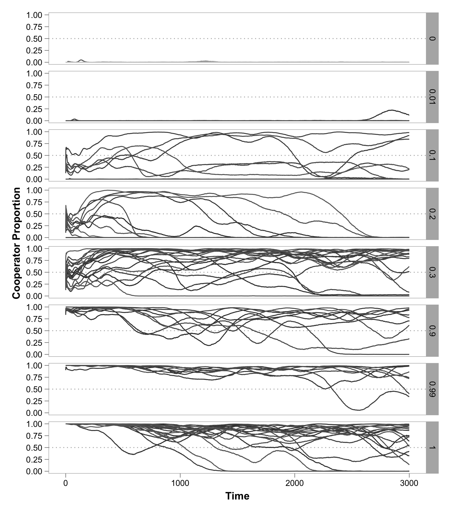
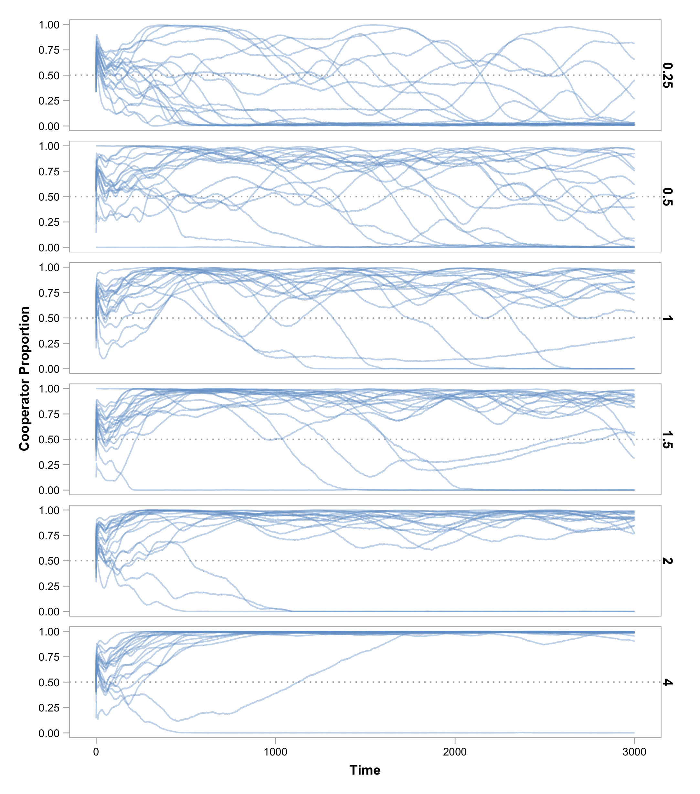

---
title: Supporting Information for "Negative Niche Construction Favors the Evolution of Cooperation"
geometry: margin=1.50in
fontsize: 12pt

# TODO - Add figure S1
# TODO: change "dilution factor"
# TODO: update references to Figure S1
...

\renewcommand{\thefigure}{S\arabic{figure}}
\renewcommand{\theequation}{S\arabic{equation}}
\setcounter{figure}{0}
\setcounter{equation}{0}

## Effect of Initial Cooperator Proportion

![**The Effect of Initial Cooperator Proportion on Cooperator Presence.** To compare how abundant cooperators are for the duration of simulations, we use the area under the cooperator proportion curves. As cooperators spend more time at high proportions, this metric increases. Here, we show how this "Cooperator Presence" is influenced by the actual initial proportion of cooperators (after thinning, see Methods). Points represent Cooperator Presence for the simulations shown above, and the solid line is a Loess curve fitted to these values with 95% confidence interval.](../figures/p0sweep_presence.png)

## Effect of Dilution Factor

![**Effect of Subpopulation Dilution.** Each panel shows the proportion of cooperators present in populations for a different dilution factor ($d$), which represents the proportion of individuals that survive the thinning that occurs during each simulation cycle. Because thinning affects the number of offspring produced during each cycle, and hence the number of mutational opportunities to gain adaptations, simulations proceeded until populations had reached $2.82\times 10^9$ births, which was the average number of births that occurred in simulations with baseline parameter values. TODO description of results](../figures/dilution.png)

## Effect of Benefits Slope

In our main simulations, the carrying capacity at each patch increased linearly with the proportion of cooperators.

$$ S(p) = S_{min} + p^{\gamma} (S_{max} - S_{min}) $$ {#eq:popsizegamma}

Blah @eq:popsizegamma Blah

When $\gamma < 1$, decelerate.
When $\gamma > 1$, accelerate.

## Misc

